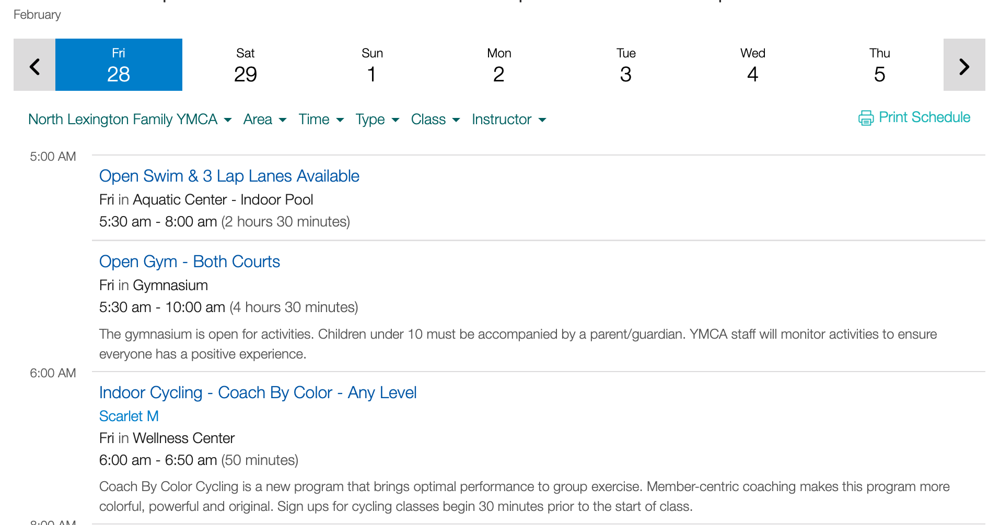
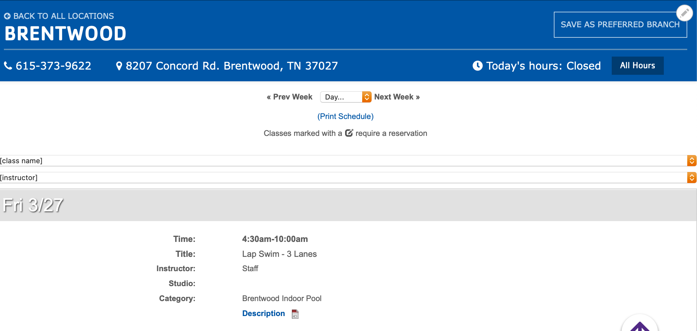

## Examples

### YMCA of Central Kentucky / Daxko Schedules iframe

### YMCA of Middle Tennessee / GroupEx Pro Script

## Areas it Should Be Used

* Content Area
* Sidebar Area
* Bottom Area

## How To Use Code

* Select “Add Code” from the paragraphs dropdown.

  
* You will see two buttons - one to add a custom block, the other to search for a custom block.

* To search for an existing custom block, type the name of the block in the autocomplete field and click on an option that appears to embed that block.

* To add a new block, click the “Add New Custom Block” button.

[Learn more about blocks ⇒](../../blocks)

* When you add your block, you will see a blank, unformatted text field. Type your HTML text into this field.

> ***To use code, you must add HTML tags.***
>
> *Hard returns will be ignored, and text will be printed out in one long string.*
>
> *Code will not highlight or color-code your HTML.*
>
> ---
>There is an option to change to a “Full HTML” text editor, which will allow you to make use of the default text editor; however, using this will strip “faulty” HTML out of your block and may prevent you from using certain tags.

Once you’re done, click the button that either says *Add custom block* or *Update custom block*, depending on the option you had selected at first.

---

## Content Types that Support Code

* [Landing Page](../../content-types/landing-page)
* [Branch](../../content-types/branch)
* [Camp](../../content-types/camp)
* Facility
* Event
* [Activity](../../content-types/activity-class-session)
* [Program](../../content-types/program)
* [Program Subcategory](../../content-types/program-subcategory)
* [Class](../../content-types/activity-class-session)
* [Blog Post](../../content-types/blog-post)
* [News Post](../../content-types/news-post)
