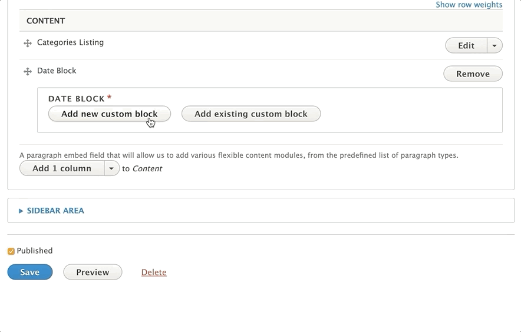
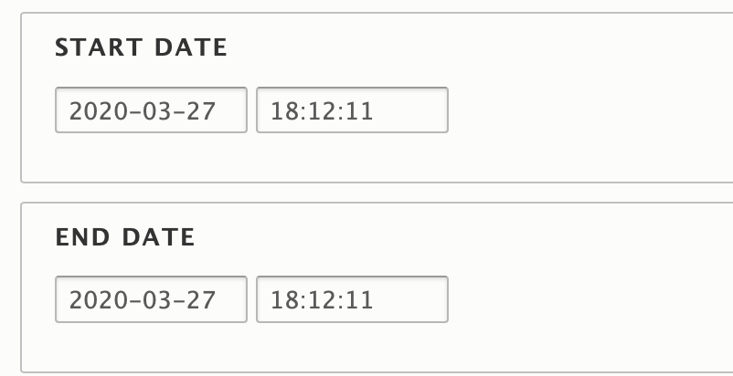
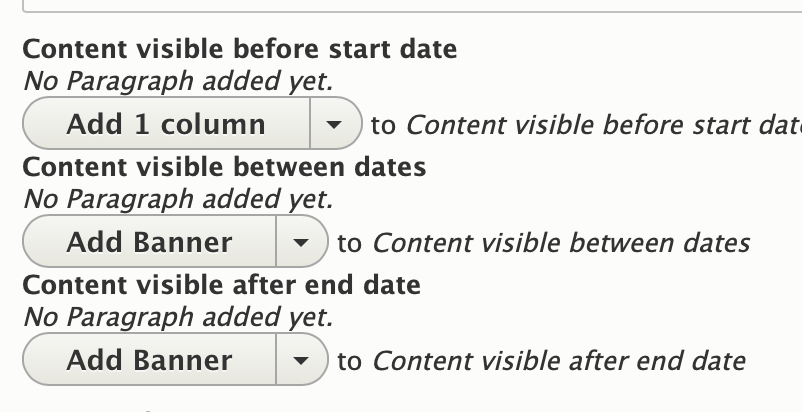

## Areas It Should Be Used

* Header Area
* Content Area
* Sidebar Area
* Bottom Area

---

## How To Use Date Block

Pick *Add Date Block* from the list of paragraphs in the dropdown. You will see two options: add a new custom block or add an existing custom block.

### Add New Custom Block

If you’re using Date Block for the first time or creating a new date block, choose the Add New Custom Block option.

Enter a label for your date block in the block description field. If and when you’d like to reuse this section on multiple pages, this is what you’ll use to search for it.

Below the block description field, you will enter a start date and an end date for your block. This schedules content in your date block to publish and unpublish, just like with a content type.

Below this you can add in paragraphs to display *Before, During and After* your scheduled dates. Add paragraphs into these fields as you normally would.

If you don't want content to display before, during or after your time period, leave it blank.

Hit “Create custom block” to add your block.

---

### Add Existing Custom Block

To reuse a date block you’ve previously created, click the “Add Existing Custom Block” button.” Enter the description of your block into the autocomplete field. Select your block from the options to drop it in.

---

### Editing a Date Block

To edit your block, click “edit” next to the paragraph. You will need to click another “edit” button when the name of your date block appears.
Make your changes inside the block and, when you’re done, click “Update Custom Block.”

> Making any changes to a date block will change it on every page where it has been added.
>
> [Learn more about custom blocks ⇒](../../blocks)

---

## Content Types That Support Date Block

* [Landing Page](../../content-types/landing-page)
* [Branch](../../content-types/branch)
* [Camp](../../content-types/camp)
* Facility
* [Blog Post](../../content-types/blog-post)
* [News Post](../../content-types/news-post)
* [Class](../../content-types/activity-class-session)
* [Program](../../content-types/program)
* [Program Subcategory](../../content-types/program-subcategory)
* Event
