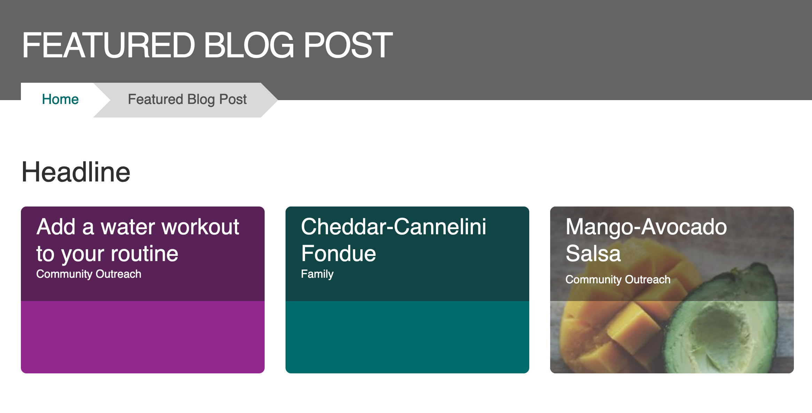
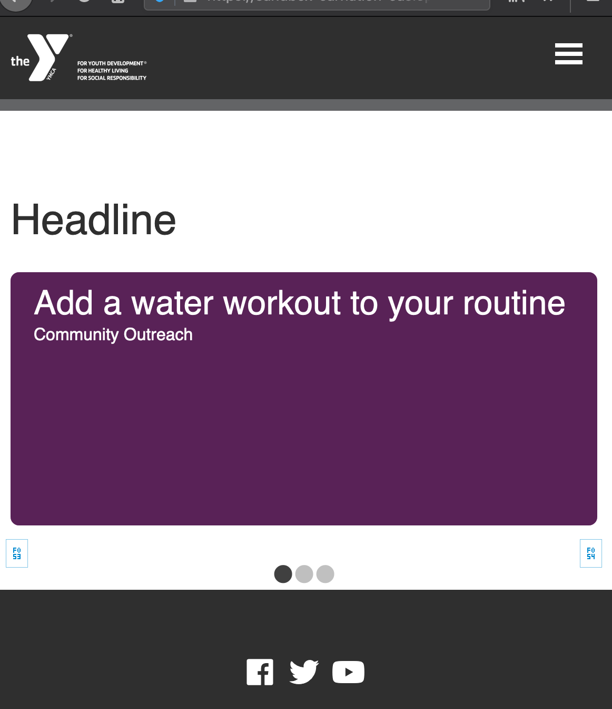
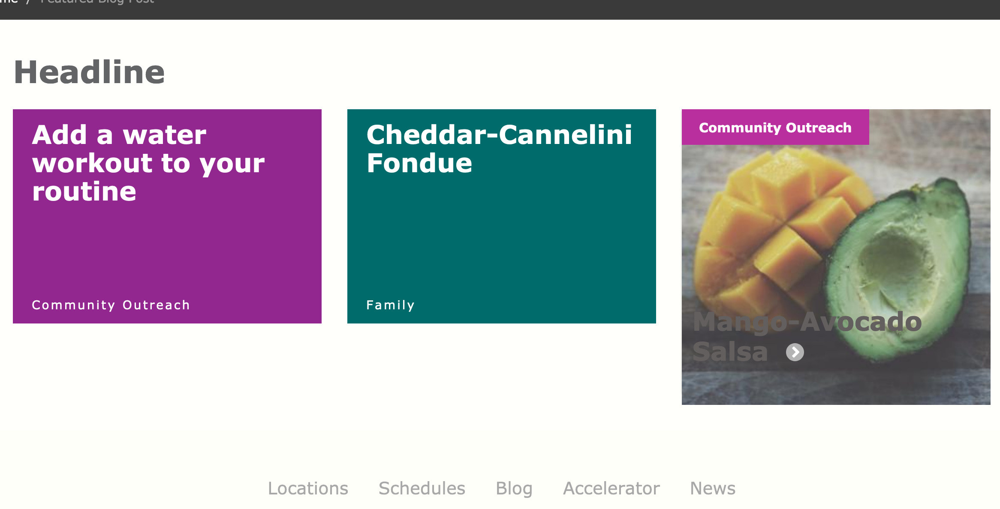
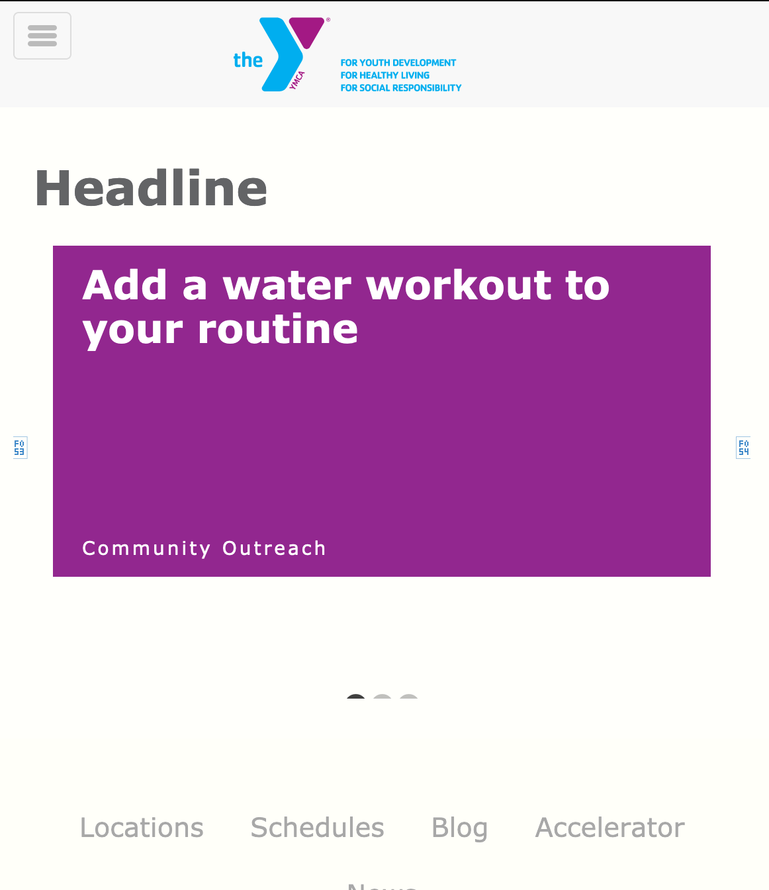
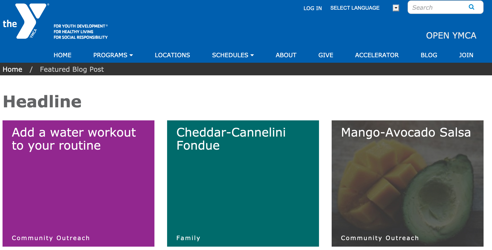
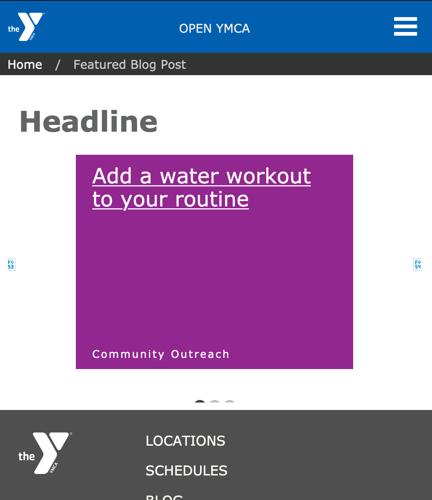
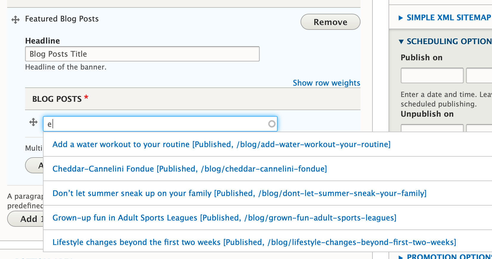

## Examples

### Carnation

#### Desktop

#### Mobile

### Lily

#### Desktop

#### Mobile

### Rose

#### Desktop

#### Mobile

---

## Areas It Can Be Used

* Content Area
* Bottom Area

---

## How to Use It

Add a headline for this section of content in the *Headline* field.

Next, type in the name of the blog you would like to feature in the autocomplete field. Click on the post when it shows up below.

To add another blog post, click the *Add another item* button. Click the blue save button at the bottom when you’re finished.

---

## Content Types that Support Featured Blog Posts

* [Landing Page](../../content-types/landing-page)
* [Program](../../content-types/program)
* [Program Subcategory](../../content-types/program-subcategory)
* [Branch](../../content-types/branch)
* [Camp](../../content-types/camp)
* Facility
* [Blog Post](../../content-types/blog-post)
