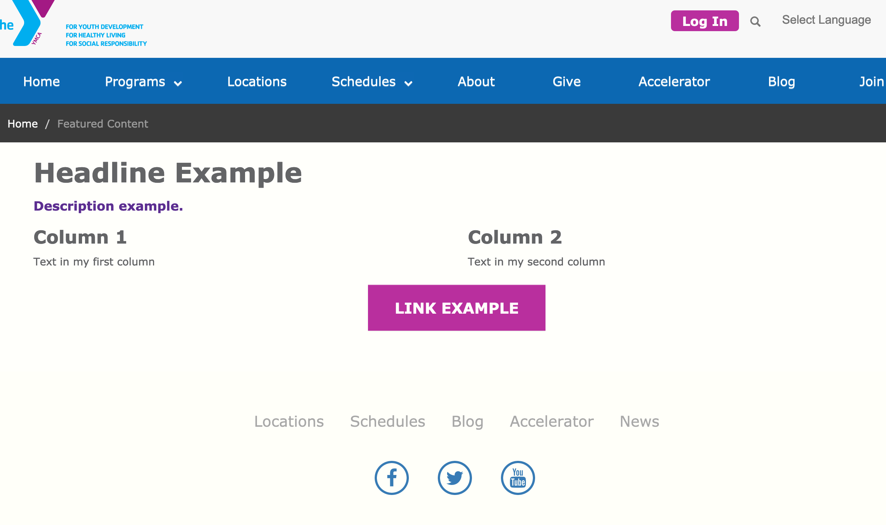
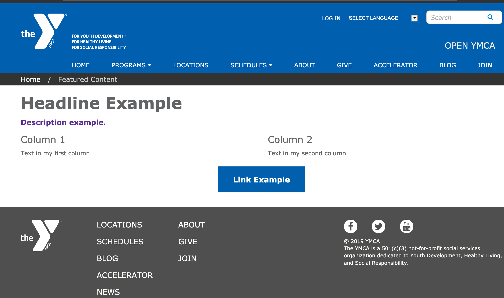
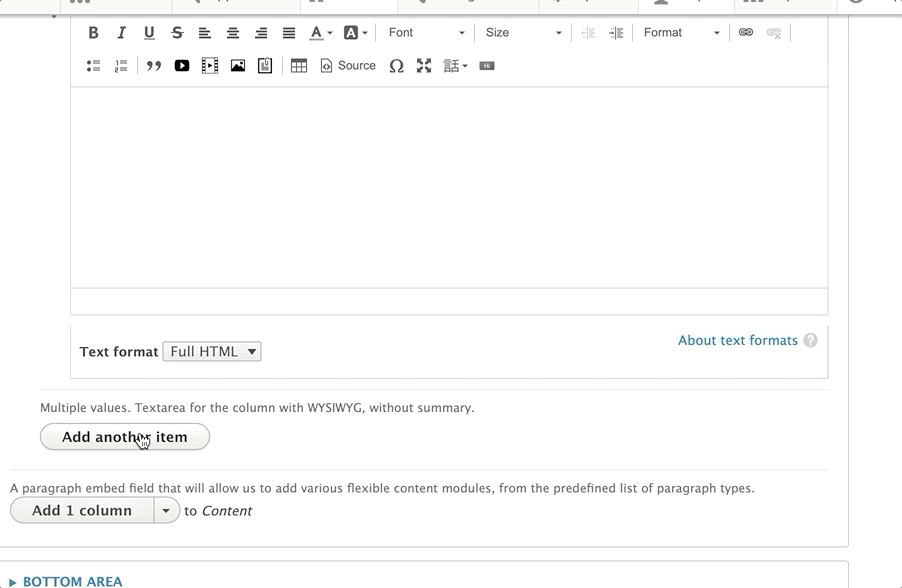

## Examples

### Carnation

### Lily

### Rose

---

## Areas It Can Be Used

* Content Area
* Bottom Area

---

## How to Use Featured Content

> *Note: The styling for Featured Content differs greatly by theme. This documentation notes the differences in styling between each theme.*

Select *Add featured content* from the paragraphs dropdown. Add an optional *headline* in the headline field above.

* **Lily/Rose:** The headline left-aligns by default.
* **Carnation:** The headline center-aligns in Carnation.

Next, add an optional *Description* [using the text editor](../../text-editor/basic-text-formatting). Avoid changing your text alignment for your description.

Add an optional link in the link field.

[Learn how to use a Link field ⇒](../../text-editor/adding-links)

---

Select the number of columns you would like to have in each row using the style dropdown.

* **Carnation**: Due to the card styling in Carnation, this field does not limit the number of cards that will display in a single row. A recommended workaround is to add multiple rows of featured content or [use the Grid Content paragraph type](../grid-content).

> ***Advanced users***: You can clear the confusion for content editors in Carnation by making the style field an optional field and hiding it in the form display in the UI.
>
> Additionally, you can limit the number of columns to four in the Featured Content’s paragraph settings.

Finally, add content for each column of content using the text editor. To add additional columns click the “Add Another Item” button.

* **Lily/Rose:** Adding more columns than what you selected in the “Style” dropdown will create additional rows. Aligning each column’s content is not recommended unless you are not using any other field.

---

## Content Types that Support Featured Content

* [Landing Page](../../content-types/landing-page)
* [Branch](../../content-types/branch)
* [Camp](../../content-types/camp)
* Facility
* [Blog Post](../../content-types/blog-post)
* [News Post](../../content-types/news-post)
* [Program](../../content-types/program)
* [Program Subcategory](../../content-types/program-subcategory)
