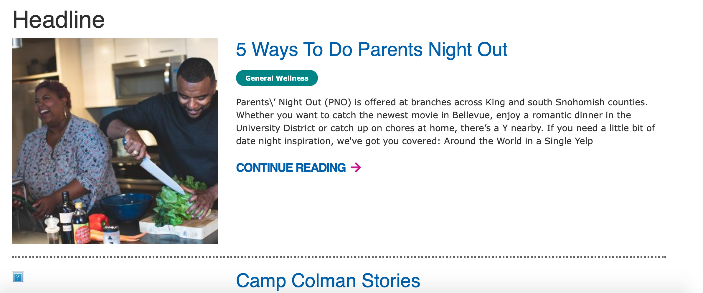
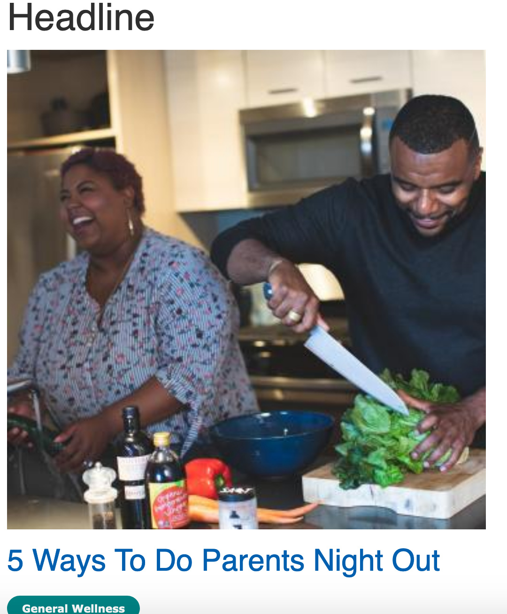
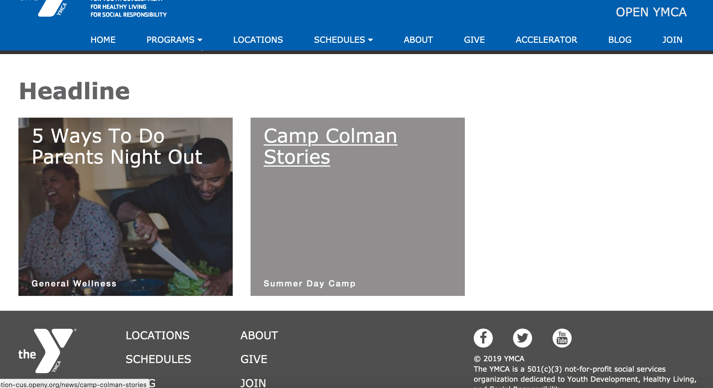
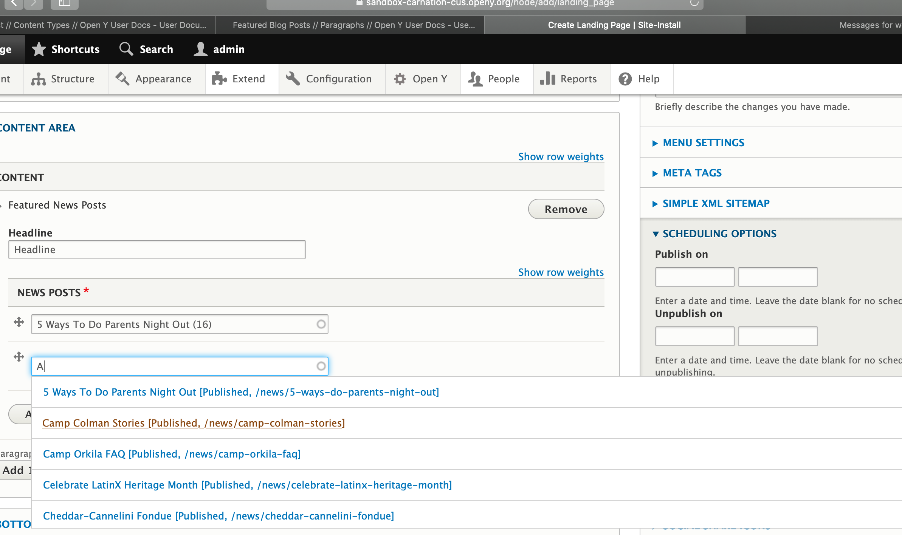

## Examples

### Carnation

#### Desktop

#### Mobile

### Rose

---

## Areas It Can Be Used

* Content Area
* Bottom Area

---

## How to Use Featured News Posts

Add a *Headline* for this section of content in the Title field.

Next, type in the name of the news post you would like to feature in the autocomplete field. Click on the post when it shows up below.

To add another news post, click the *Add another item* button. Click the blue save button at the bottom when you’re finished.

## Content Types that Support Featured News Posts

* [Landing Page](../../content-types/landing-page)
* [Program](../../content-types/program)
* [Program Subcategory](../../content-types/program-subcategory)
* [Branch](../../content-types/branch)
* [Camp](../../content-types/camp)
* Facility
* [News Post](../../content-types/news-post)
