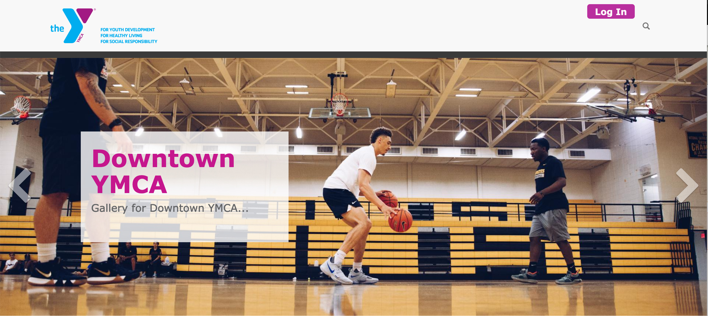
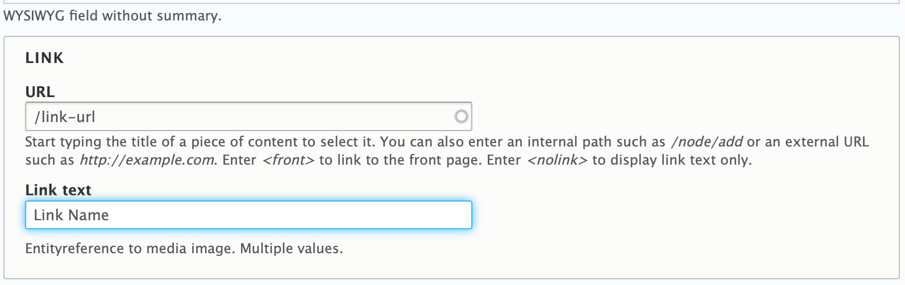
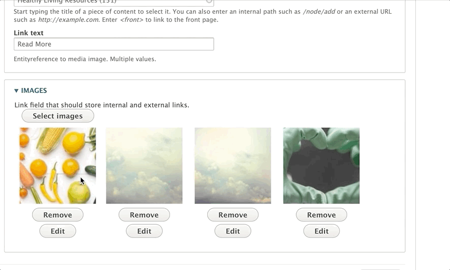

The gallery can play on a loop, and users can click back and forth using the arrows.

You can have a gallery with a simple title, and you can also add a description below the headline and/or a call to action button.

## Examples

### Carnation

#### Desktop

#### Mobile

### Lily

#### Desktop

#### Mobile

### Rose

---

## Areas It Can Be Used

* Header Area
* Content Area
* Bottom Area

---

## How to Add/Edit a Gallery

Once you’ve selected a gallery from the paragraphs dropdown, enter a *Headline* for the gallery.

Next, if you would like to add a subhead or description below your title, add it below the headline in the *Description* field.

> Only use basic text formatting on your description, such headlines. Avoid using bullets or numbered lists in this field.
>
> [Learn more about the text editor ⇒](../../text-editor)

Optionally, you can add a Link in the link field.

[How link fields work in YMCA Website Services ⇒](../../content-editing-basics/#linksbutton-fields)

Below the link field, you will add your images. Click on the *Add images* button to select the pictures for your gallery. You can upload an image to the media library, or select multiple images from your library.

Once you’ve uploaded/selected your images, click that blue *Add images* button at the bottom.

To order your images, hover your mouse over the thumbnail in the “Images” section, and then drag them to reorder. You will see a cross-arrow icon when you’re dragging them around, similar to what you see when you reorder paragraphs.

To delete a photo from the gallery, click the delete button below the image.

Hit *Save* at the bottom of the image to save it.

---

## Content Types that Support Galley

* [Landing Page](../../content-types/landing-page)
* [Program](../../content-types/program)
* [Branch](../../content-types/branch)
* [Camp](../../content-types/camp)
* Facility
