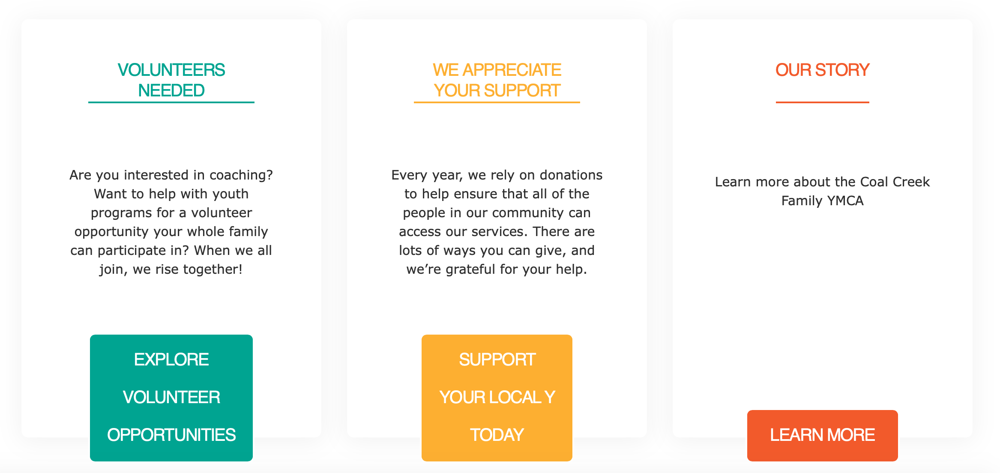
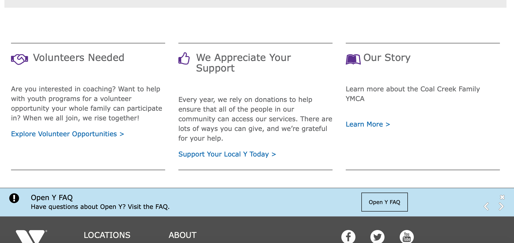
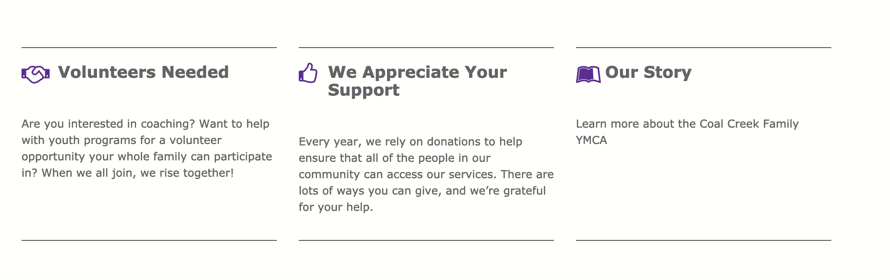
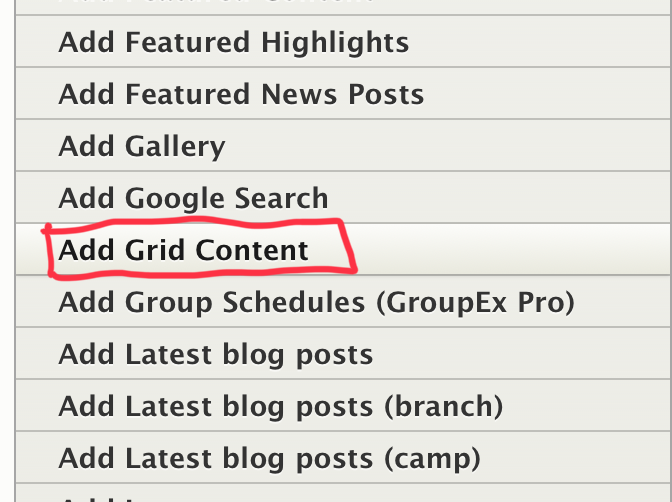
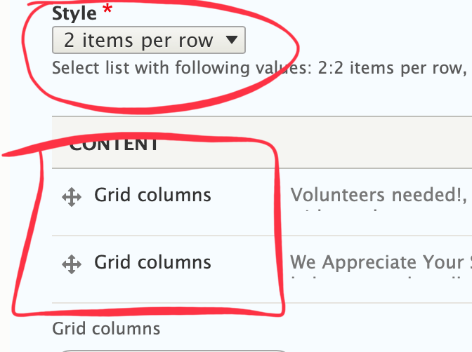
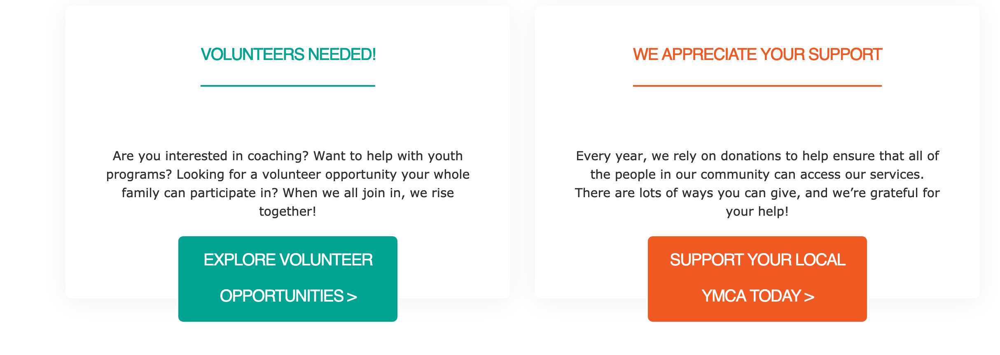
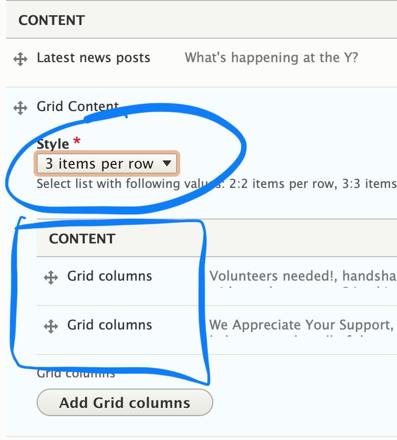
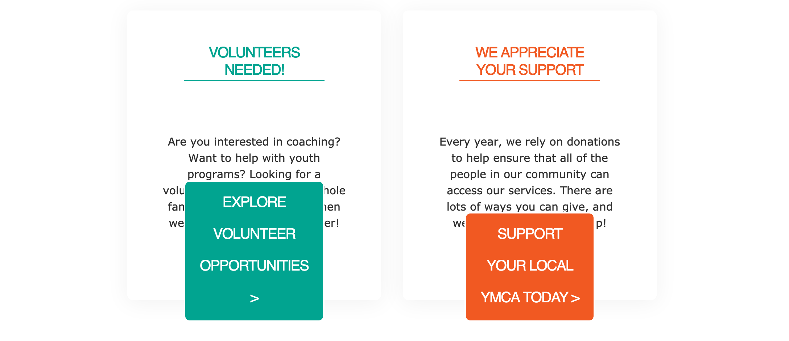

## Examples

### Carnation

### Lily

### Rose

---

## Areas It Should Be Used

* Content Area
* Bottom Area

---

## How to Use Grid Content
>
> *Note on Grid Content: This paragraph’s style will vary greatly depending on your theme. The docs outline how to use the fields.*

First, choose *Grid Content* from the Paragraphs dropdown. You will then see a dropdown with four options under *Style*:

* 2 items per row
* 3 items per row
* 4 items per row

Select a style to choose how wide you want each section to be; the more items per row, the narrower they will be.

### Examples

#### 2 items per row w/ 2 Grid Columns

#### 3 items per row w/ 2 grid columns

Next, you will see a button that says *Add Grid Columns.* This is where you will start adding your individual sections/cards.

For each item you add, you will have the following fields:

* **Headline (optional)** - A title for your section. Will be larger/smaller depending on your selected style and theme

* **Icon (optional)** - An image you can embed to display inline with your headline. Upload a new image or use one in your image library.

* **Icon Class** - [A font awesome icon CSS class](https://fontawesome.com). You can type in the name of the class, and YMCA Website Services will generate the icon.

  [Using Icon Fields in YMCA Website Services ⇒](../../text-editor/building-buttons/#icons-tab)

* **Description** - A standard text editor field. Because of how each grid content item styles, it’s recommended that the text in this field be shorter than 200 characters.

  [How to use the Text Editor in YMCA Website Services ⇒](../../text-editor)

* **Link** - Two fields to add a URL and a link. Depending on your theme, the link will style either as a basic link or as a button.

  [How link fields work in YMCA Website Services ⇒](../../content-editing-basics/#linksbutton-fields)

> Note: If you add more items than your selected style, you will create a new row. For example:
>
>* 2 items per row style, 3 items added -> two rows of content
>* 3 items per row style, 5 items added -> two rows of content
>* 4 items per row style, 9 items added -> three rows of content

---

## Content Types that Support Grid Content

* [Landing Page](../../content-types/landing-page)
* [Branch](../../content-types/branch)
