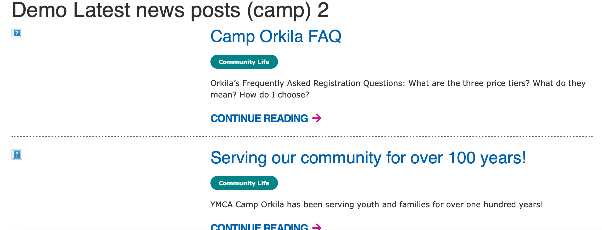
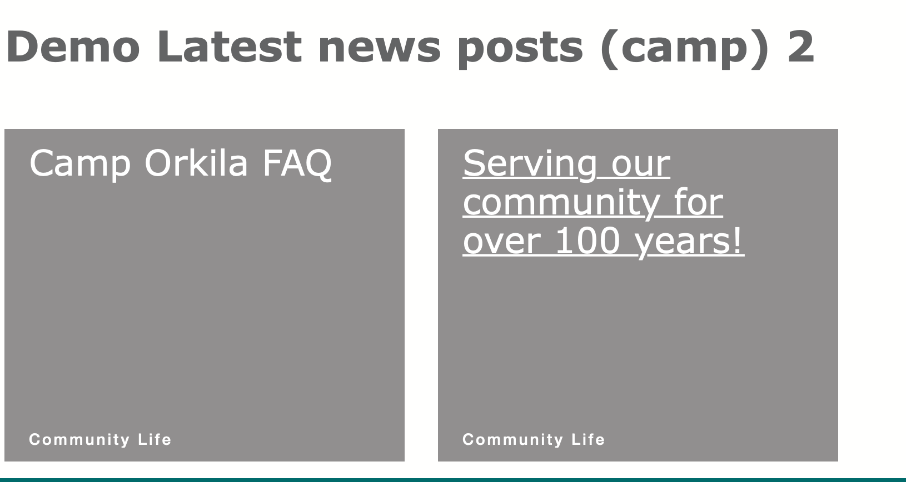

These three paragraphs embed a listing of News posts, sorted by the most recent, in a row/listing design

* **Latest News Posts** shows all the most recent news posts across your entire site.
* **Latest News Posts (Branch)** filters news posts by the branch the paragraph is embedded on (for example, if on a Downtown YMCA page, only Downtown YMCA news posts will show up). Placed on a non-branch page, only the headline will show up.
* **Latest News Posts (Camp)** filters News posts by the branch the paragraph is embedded on (for example, if on a Camp Widjiwagan page, only Camp Widjiwagan YMCA News posts will show up). Placed on a non-camp page, only the headline will show up.

## Examples

### Carnation

### Rose

---

## Areas it Should Be Used

* Content Area
* Bottom Area

---

## How to Use Latest News Posts

From the paragraphs dropdown, add the “Latest News Posts.” Enter a header title for the section in the text field and hit save.

---

## Content Types that Support Latest News Posts

* [Landing Page](../../content-types/landing-page)
* Facility

## Content Types that Support Latest News Posts (Branch)

* [Branch](../../content-types/branch)

## Content Types that Support Latest News Posts (Camp)

* [Camp](../../content-types/camp)

## Related/Alternative Paragraphs

* Event Posts Listing
* [Blog Posts Lisiting](../blog-posts-listing)
* [Latest News Posts/(Camp)/(Branch)](../latest-news-posts)
* [News Posts Listing](../news-posts-listing)
