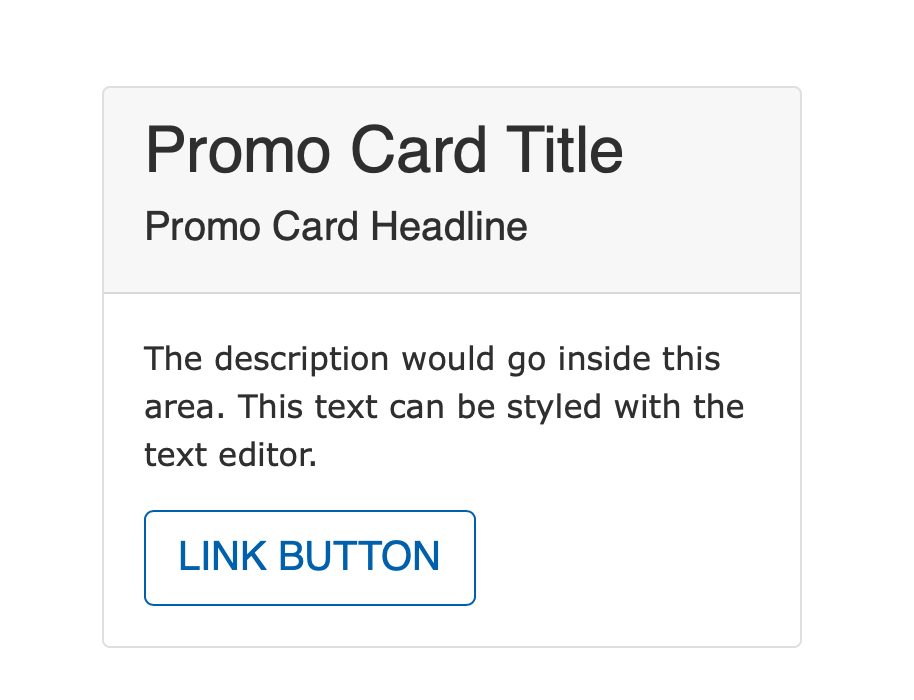
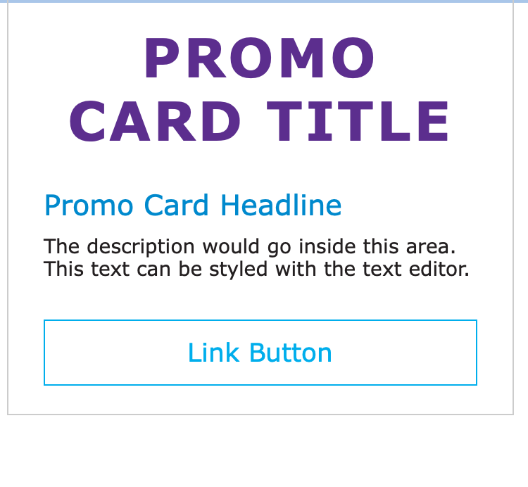

## Examples

### Carnation

### Lily

### Rose

---

## Areas It Should be Used

* Sidebar Area

---

## How to Use the Promo Card

In your sidebar area, select *Add Promo Card* from the paragraphs list.

You can add an optional large *Title* in the top text field, while the required *Headline* field puts a smaller headline below the title.

The description field is a text editor that allows you to enter any content you want with the standard text editor options.

[Learn how to use the Text Editor ⇒](../../text-editor)

You can add link and call to action text in the Link field.

[Learn how to use link fields ⇒](../../content-editing-basics/#linksbutton-fields)

---

## Content Types that Support Promo Card

* [Landing Page](../../content-types/landing-page)
* [News Post](../../content-types/news-post)
* [Blog Post](../../content-types/blog-post)
* [Program](../../content-types/program)
* Facility
* [Program Subcategory](../../content-types/program-subcategory)
