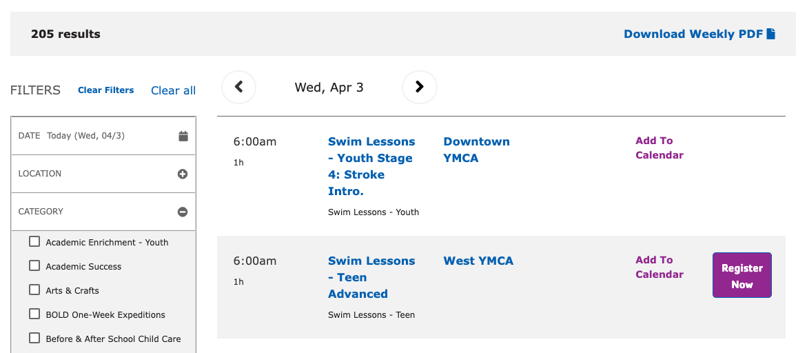

Sometimes called “Group Exercise” or “Group Schedules”, the Repeat Schedules block provides a similar view to Activity Finder, but focused more on recurring, often drop-in classes.

See [Group Schedules](../../schedules/group-schedules) for more details.

## Examples

[On the sandbox site](https://sandbox-carnation-cus.y.org/schedules-0).

## How to use

To use the Repeat Schedules paragraph:

- Expand the **Content Area** on a Landing Page.
- Choose **Add Repeat Schedules**.
- See [Group Schedules Block Configuration](../../schedules/group-schedules#block-configuration) for configuration details.
- Save the page.

## What fields are where

See [Group Schedules Front-end](../../schedules/group-schedules#front-end).
