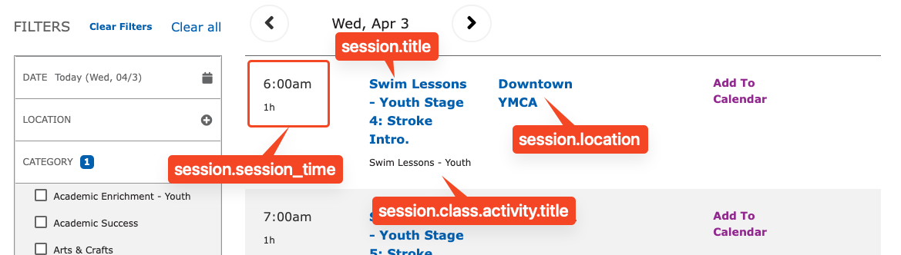
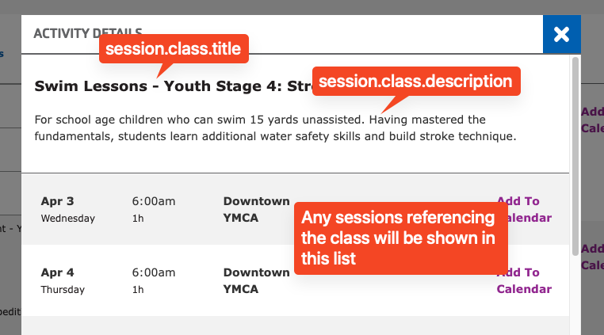

## Examples

[On the sandbox site](https://sandbox-carnation-cus.y.org/schedules-0).

## How to use

To use the Repeat Schedules paragraph:

- Expand the **Content Area** on a Landing Page.
- Choose **Add Repeat Schedules**.
- Configure the options:
  - **PDF Schedule link** - a link to a manually-generated PDF as an alternative to the automatically generated one.
  - **Clear All link** - where the user is directed when they use the "Clear all" link.
  - **Limit by category** - choose categories aith autocomplete to only show certain categories.
  - **Filters** - choose the filters that show up in the sidebar.
  - **Limit by Location** - choose a location to only show events from that location.
  - **Display instructor**
  - **Display end time**
  - **Categories Exclude** - exclude any programs that are tagged with specific categories.
  - **PDF only view** - only show the PDF link and not the schedule.
- Save the page.

## What fields are where

Data from Session, Class, and Activities are all used to form the Repeat Schedules. Here's what shows up where. Fields are noted with their relationships, so `session.class.activity.title` means "the title of the Activity referenced by the Class referenced by the Session".

Fields used in the table view:

Fields used in the popup view:

