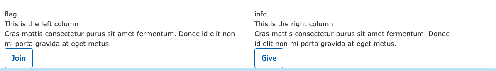
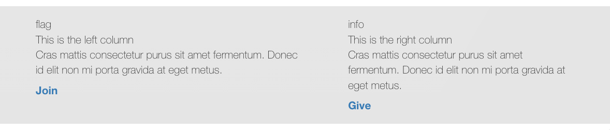
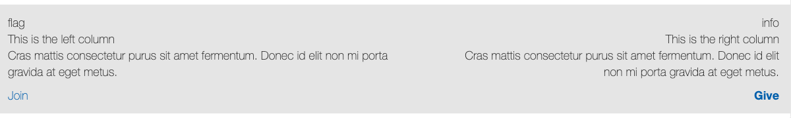
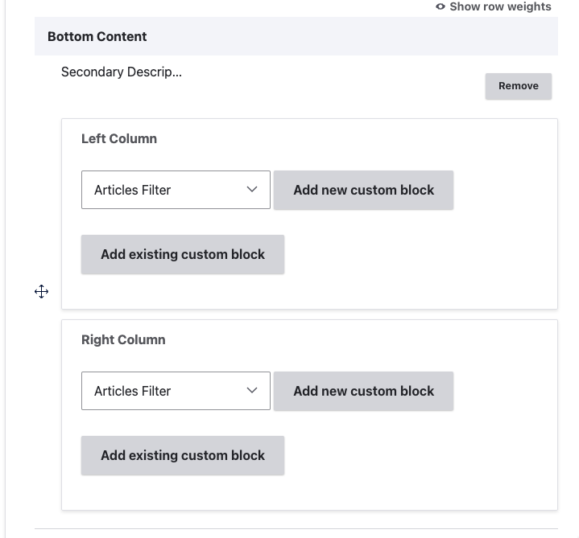

> Note: This element does not work properly in Carnation and is considered deprecated.

## Example

### Carnation

### Lily

### Rose

## Areas it Should Be Used

* Bottom Area

## How to Use Secondary Description and Sidebar

Insert the paragraph from the dropdown into the Bottom Area.

You will have two fields to insert blocks - a Left Column and a Right Column. Select from one of four different custom block types, and either add a new custom block or reuse an existing block type.

[Learn how to use custom blocks >](../../blocks)

Note: When reusing blocks, the icon field does not work in this paragraph. Font awesome icons will render as text.
