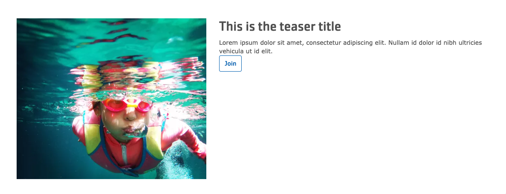
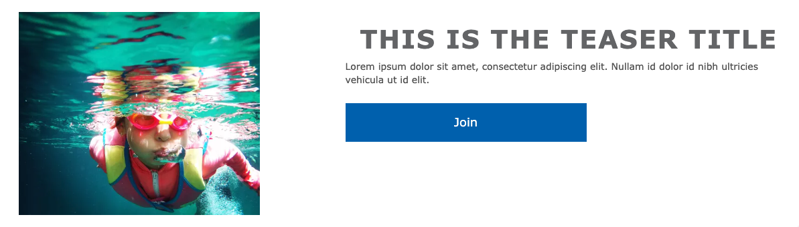
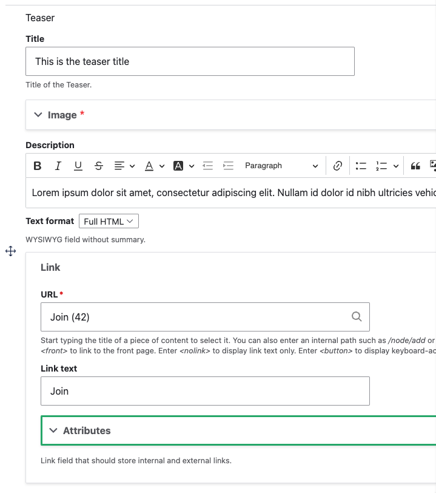

## Example

### Carnation

### Lily

### Rose

## Areas it should be used

- Content area

## How to use Teaser

Insert the paragraph from the dropdown into the Content Area.

Fill out the content fields:

- **Title**
- **Image** - select an image from the image library or upload a new one
- **Description** - add a description using the [Text Editor](../../text-editor).
- **Link** - add an internal or external link

Save the page to view your Teaser.
