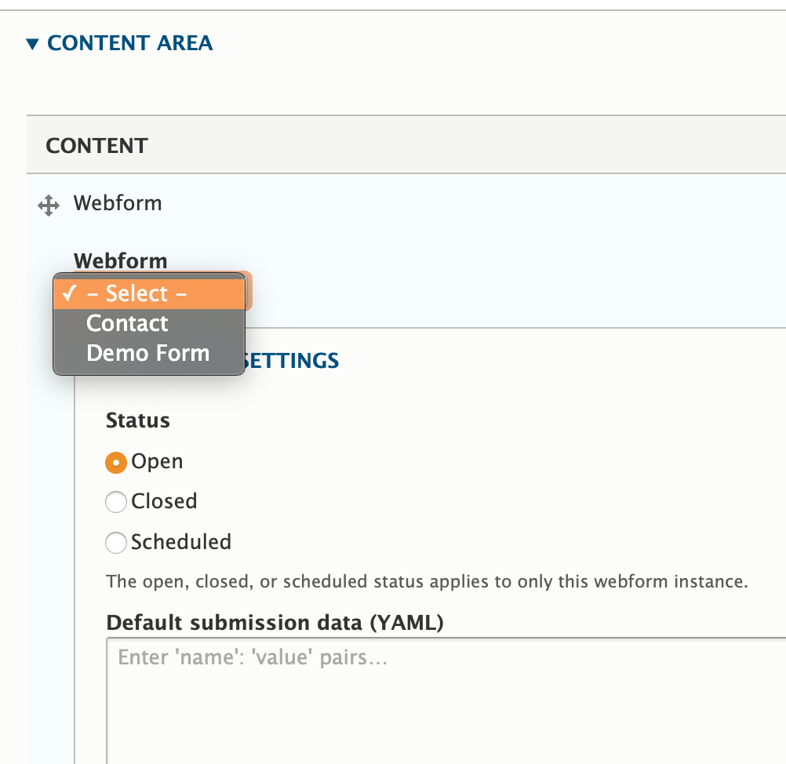

## Areas it Should be used

* Content Area
* Sidebar Area
* Bottom Region

---

## How to Use Webform

> **Prerequisite**: You must have your web form created before embedding onto a page. While you can continue to revise and edit your form, using this paragraph will NOT create a webform for you.
>
> **[Drupal Webform Tutorials (by Jacob Rockowitz) ⇒](https://www.youtube.com/playlist?list=PLXu9x8jV-0fDQz_7BXVeAbFNOoYLQhcJ1)**

Once you’ve selected *Webform* from the paragraphs dropdown, select the name of the webform you want to embed onto your page.

Next, you will have the option to open, close or schedule your open/close dates for your webform.

> Ignore the “Default submission pairs” field, unless you’re [a YAML wizard](https://yaml.org) and want to have some default values for certain fields in case your users forget to fill them out.

---

## Content types that Support Webform

* [Landing Page](../../content-types/landing-page)
* [Branch](../../content-types/branch)
* [Camp](../../content-types/camp)
* Facility
* [Program](../../content-types/program)
* [Program Subcategory](../../content-types/program-subcategory)
* [Blog Post (Lily/Rose only](../../content-types/blog-post))
* [News Post](../../content-types/news-post)
* Event
