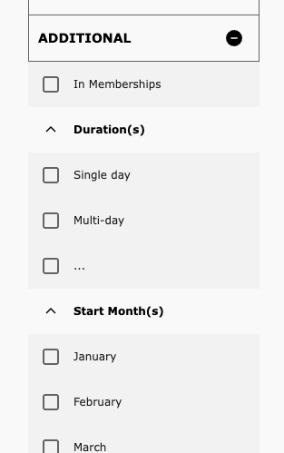
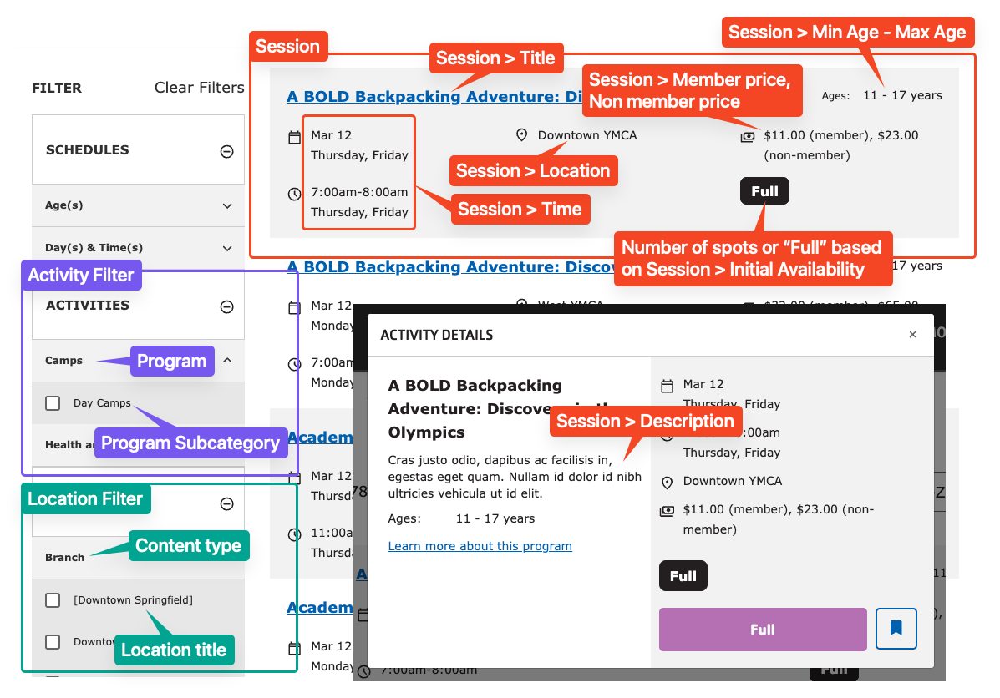

Activity Finder combines data from [the Activity, Class, and Session](../../content-types/activity-class-session) content types into an interactive tool that can be used with [Paragraphs](../../paragraphs/activity-finder) or [Layout Builder](../../layout-builder/activity-finder) pages.

Out-of-the-box, YMCA Website Services’s Activity Finder integrates with [Daxko](https://www.daxko.com/), [ActiveNet](https://www.activenetwork.com/activenet), and [Personify](https://personifycorp.com/solutions/ymcas-and-jccs/). Configuring these integrations is mostly user-friendly, but often is supported by a partner development team. Any other CRM will require custom developer work.

See the [Program Event Framework developer docs](../../../development/program-event-framework) for a full list of integrations.

## Block configuration

When you add the Activity Finder block to a page, you have a number of options. These are in addition to the configuration at **Admin** > **YMCA Website Services** > **Settings** > **Activity Finder Settings** (`/admin/openy/settings/activity-finder`). See [the Activity Finder module README](https://github.com/YCloudYUSA/yusaopeny_activity_finder?tab=readme-ov-file#open-y-activity-finder) for more information.

- **Location & Category Filters** - Restrict this block to show sessions from only certain Locations or Categories. 'Limit' will show only the specified options. 'Exclude' will remove the specified options. Generally you should choose either Exclude or Limit, not both.
  - **Limit by location** - Only show sessions at specific locations in the results.
  - **Exclude by location** - Remove sessions at specific locations from the results.
  - **Limit by category** - Only show sessions related to specific Program Subcategories in the results.
  - **Exclude by category** - Remove sessions related to specific Program Subcategories from the results.
- **Legacy mode** - Shows some data as it was in the previous version of Activity Finder (v3):
    - Disables bookmark functionality on the results screen.
    - Doesn't display the age indicator in the result card of activities.
    - Changes the days + times wizard step. Displays only days of week, but not times of each day (doesn't support DaysTimes filter)
- **Weeks filter** - Changes the Day/Time filter to use custom defined Week filters.
    - This requires setting the **Weeks** configuration in the **Activity Finder settings** (`/admin/openy/settings/activity-finder`).
    - Note: Only sessions that have "Camp" in the title or room fields will return for this filter.
- **Additional filters** - These filters are off by default, but can be enabled in the Block Configuration. 
  - **Start Month** - Filters based on the month in the **Session Time** field.
  - **In Membership** - Shows Sessions that have **In membership** checked.
  - **Duration** - The length of the Session. This is configurable in the **Activity Finder settings** (`/admin/openy/settings/activity-finder`) and defaults to:
    - Single day
    - Multi-day (up to 5 days)
    - Weekly (up to 3 weeks)
    - Monthly (up to 5 weeks)
    - Season (up to 12 weeks)
    - School year (~9 months)
    - Full year
- **Hide Home Branch info block** - Disables functionality related to the user's selected home branch.
- **Background image** - An image that's displayed in the background of the banner above Activity Finder.

## Front-end

Once the [Activity Finder Paragraph](../../paragraphs/activity-finder) or [Activity Finder Layout Builder Block](../../layout-builder/activity-finder) has been added to a page, users can see its content.

### Filters

- **Schedules** - Filters by a number of facets, which are configurable in the Block Configuration or Activity Finder settings.
  - **Age(s)** - Filters based on the **Min Age** and **Max Age**. Age ranges are configurable in the **Activity Finder settings** (`/admin/openy/settings/activity-finder`).
  - **Day(s) & Time(s)** - Filters by the time of date on specific days of the week. This filter has no configuration.
  - **Weeks** - Replaces date/time filter when **Weeks filter** is selected in the Block Configuration. See configuration requirements above.
- **Activities** - **Program Subcategory** filters grouped by **Program**.
- **Locations** - **Location** filters grouped by **Content type**.

See [Block Configuration](#block-configuration) for more detail on other available filters.

### Results

The filtered results in the Activity Finder app are a list of **Sessions** that meet the given filter criteria.

Each row of results contains:

- The Session **Title**.
- The Session **Time**, which contains a date, days of the week, and times.
- The Session **Location**
- The Session **Min/Max Age**
- The **Member Price** and **Non-member price**
- An indication of the number of spots available, from the **Initial Availability** field.

Clicking on the row will bring up a pop-up with further details:

- The Session **Description**
- A "Learn more" link and "Register" button which both go to the URL in the Session **Registration Link** field.

## Additional topics

### Allowing UTM codes in Activity Finder

[UTM codes](https://en.wikipedia.org/wiki/UTM_parameters) can be used to track the effectiveness of marketing campaigns. Activity Finder uses query strings as filters, but as of [version 4.2.0](https://github.com/YCloudYUSA/yusaopeny_activity_finder/releases/tag/4.2.0) it will also maintain UTM codes in the URL.

Activity Finder begins with a number of preset arguments, and those can be modified at **Admin** > **YMCA Website Services** > **Settings** > **Activity Finder Settings** (`/admin/openy/settings/activity-finder`) in the **Allowed Query Arguments** field.

Once those settings are saved, you can visit an Activity Finder page with UTM codes attached, for example:

`https://example.com/activity_finder?step=results&selectedAges=24&selectedLocations=1541437&selectedActivities=2786027,2786083&utm_source=promotional_member&utm_medium=email&utm_content=button_register_now&utm_campaign=fall_group_swim_lessons_2021`

and see that the codes are maintained as the filters are changed.
