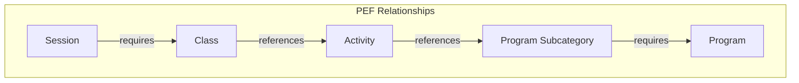
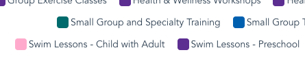
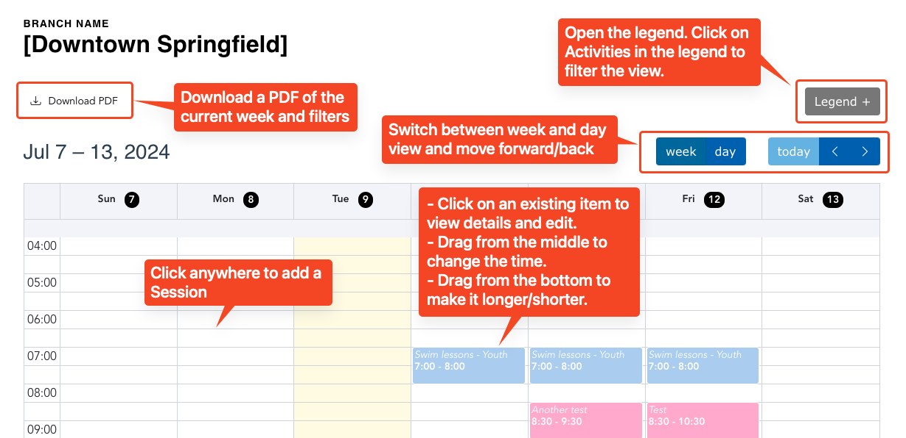
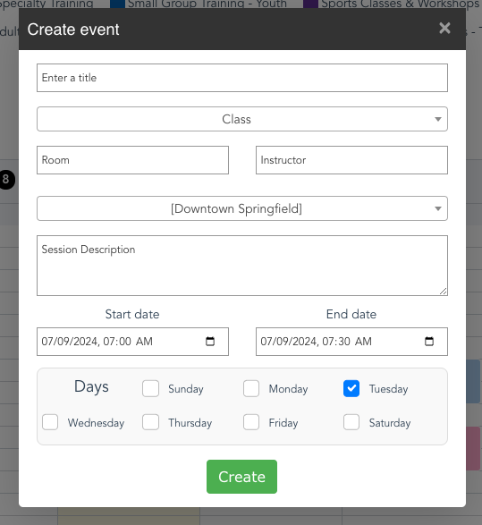

[YCloudYUSA/y_pef_schedule](https://github.com/YCloudYUSA/y_pef_schedule)

See [PEF Schedules](../../../development/program-event-framework/pef-schedules) for installation instructions.

Once you install the PEF Schedules module, you will be able to build schedules and add sessions via a calendar-based builder.

## Before you start

### Create schedule groupings

The Schedule editor allows Content Editors to create Sessions on a "WYSIWYG" calendar interface. As described in the [PEF data model](../../../development/program-event-framework#data-model), [Sessions](../../content-types/activity-class-session#session) require [Classes](../../content-types/activity-class-session#class), which require [Activities](../../content-types/activity-class-session#activity), which require [Program Subcategories](../../content-types/program-subcategory), which require [Programs](../../content-types/program).

You will need to create **at least** a Class and Activity to start adding events to the calendar. Go to **Admin** > **Content** > **Add Content** (`/node/add`) to start adding items.

If you have preexisting content for any of these content types you can use them here. You may first need to configure the Activity Color for existing Activities.

### Activity colors

PEF Schedules adds a new **Color** field to Activities which is used to style the categories on the calendar.

The **Color** field takes a hex value (`#XXXXXX` where `X` is a hexadecimal character (`0-9`, `a-f`)). We recommend using colors from the [Brand Standard Color Wheel](../../../development/colorways#base-variables). The default color is configurable in the Calendar Settings. We recommend selecting dark tones from the color wheel. as the item titles are displayed with white text.

### Calendar settings

Settings for the calendar are configurable at **Admin** > **YMCA Website Services** > **Settings** > **Schedules calendar settings** (`admin/openy/settings/schedules-calendar`).

Options include:

- Slot settings - These relate to creating events on the calendar.
    - **Slot Duration** - The default length of each time slot.
    - **Snap Duration** - The default granularity to which events "snap" when clicking and dragging on the calendar.
    - **Slot Label Interval** - The interval between time labels on the calendar's time axis.
- Time Settings - These help make the calendar display more relevant to your user's needs.
    - **Min Time** - The earliest time that is visible on the calendar view.
    - **Max Time** - The latest time that is visible on the calendar view.

## Manage schedules

Once everything is configured, you can start managing schedules. See a list of available schedules at **Admin** >
**Content** > **Schedules Calendar** (`admin/openy/branch-schedules`). Click on one of the options to open the editable schedule.

When in the schedule, you can:

- Click **Download PDF** to download a PDF of the current display.
- Click **Legend** to open the legend, then click items in the legend to filter the view.
- Use the **Week/Day** buttons to filter and change the view or page between weeks/days.
- Click anywhere in the calendar to add a session.
- Click on an existing item to view its details and edit.
- Drag from the middle of an item to change its time.
- Drag from the bottom of an item to change its duration.

### Create sessions

When creating a session from the schedule, you'll see a simplified version of the **Add Session** (`/node/add/session`) form.

- Enter a **Title** (required).
- Select a **Class** from the dropdown (required).
- Enter a **Room** and/or **Instructor** (optional).
- Choose a **Location** (required).
- Add a **Session Description** (optional).
- Set a **Start date/time** and **End date/time** (required). The **time** values will determine when on each day the session happens. The **dates** will determine the start and end of its recurrence if it happens across multiple days.
- Set the **Days** on which the Session recurs during the duration of the dates set above (required).

## Display schedules

Once content is added to the schedule, you have several options for showing it to users:

1. Place the [Simple Schedule block](../../layout-builder/simple-schedule) on any Layout Builder page.
2. All items added via the Simple Schedule will be shown in [Activity Finder](../activity-finder) or [Group Schedules](../group-schedules). Follow the directions on those pages to configure the respective components and add them to a page.
3. Download the schedule PDF and upload it somewhere on your site.
