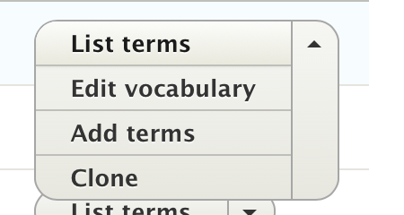
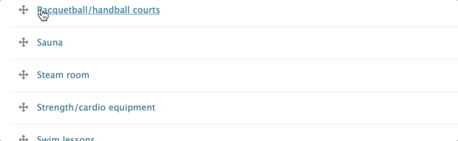
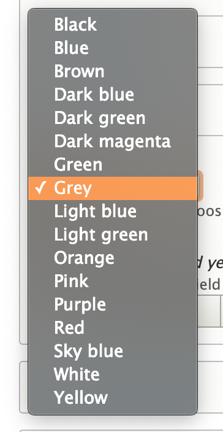
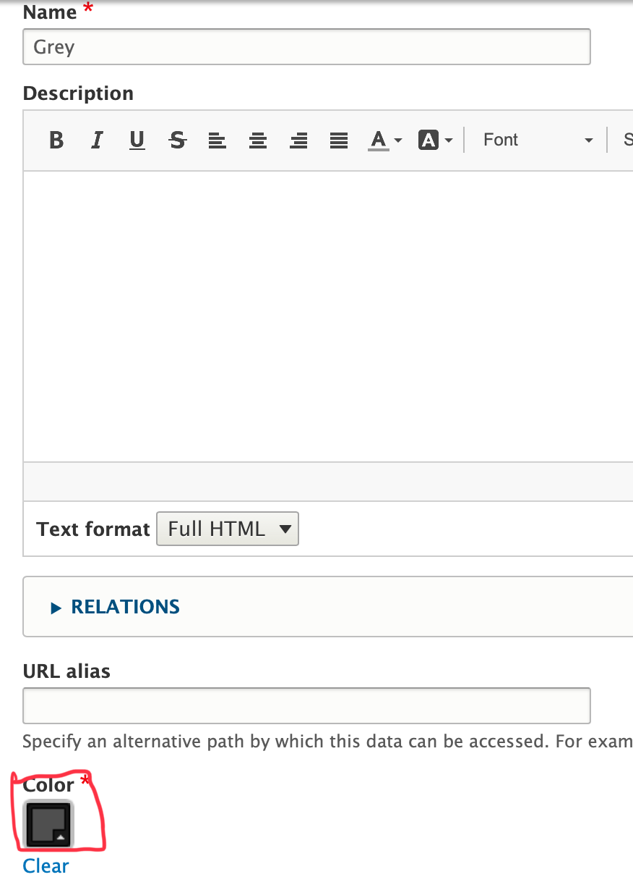
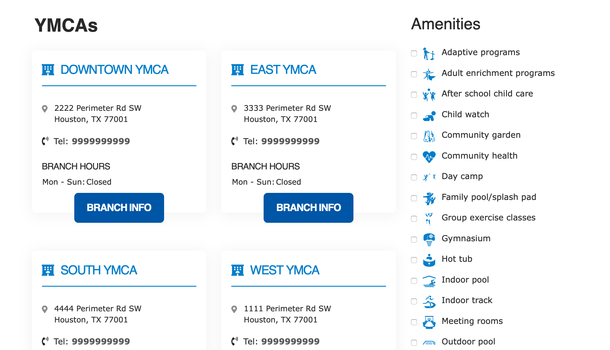

The Taxonomy feature in YMCA Website Services creates organized lists of categories, which allow you to group content, create folders for Images ([in YMCA Website Services 2.4 and later](https://github.com/ymcatwincities/openy/releases/tag/8.2.4.0)) and create standard options for dropdown fields in your content.



Each list is called a *Vocabulary*, while each item in your list is called a *Term*. Terms comprise a Term Name and any additional data/settings for that particular vocabulary (see below in *Vocabularies in YMCA Website Services* for details).

## How to Edit Vocabulary Lists

Go to **Structure** > **Taxonomy**. When you find the Vocabulary you want to edit, click *List Terms*.

You can rearrange your terms by hovering your mouse over the cross icon and dragging them. This will determine the order in which they appear. By default these are alphabetical.

Moving a term to the right will "nest" it underneath another term, making it a "child" to that term.

## Adding/Editing Terms

Click on *Edit* to make changes to an existing item or *Add Term* to add a new one.

On the next page, you can add a *Name* for your vocabulary and an optional *Description*.

Below those two fields, you can add the additional information unique to your vocabulary.

### Term Example - Grey Color

> The *Color* Vocabulary provides a standard list of color options across your website, such as in a background color for your header.
>
> 
> To change your shade of grey, you would go to **Structure** > **Taxonomy** > **Color** > **Grey**.
>
> Below the name of your Grey term, you'll find a color widget where you can change your standard shade of Grey across your site.
>
> In this example, you can change the color of the *Grey* term in the *Color* Vocabulary using a Color widget.

## Vocabularies
Because Vocabularies are lists of categories, how they will show up depends on which Vocabulary you use.

### Amenities
Used for tagging [branches](../content-types/branch) with amenities. Amenities display on a branch page and as a filter on a locations page.

### Color
As mentioned above, Color is a list of colors you can use across your site, primarily in your page headers, [small banners](../paragraphs/small-banner), [galleries](../paragraphs/gallery) and [banners](../paragraphs/banner).

### Blog/News Category
These taxonomies tag blog/news posts. Categories display in the sidebar and as filters in your [Blog Post Listing](../content-types/blog-post) and [News Posts Listing](../content-types/news-post) paragraphs, respectively.

### Media Folders
Creates folders for your images in the media browser.

[View Media Folders tutorial ⇒](https://youtu.be/gcaBlhyPZEY)

### Media Tags
Creates tags for filtering images (YMCA Website Services 2.3.3 and earlier), Documents and Videos in the media browser.

[View Image and Document tutorials](../media)