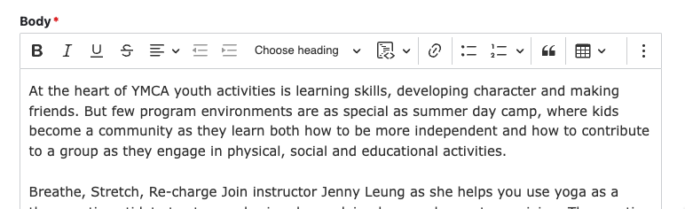

This tool allows you the flexibility to format content however you want within a certain container or area.

Bundled with the Drupal core and the distribution, [CKEditor](https://ckeditor.com/ckeditor-5/demo/feature-rich/) provides a number of different buttons for styling and formatting, as well as a Source editor if you are so inclined to edit HTML directly.

CKEditor has been [upgraded to version 5](https://www.drupal.org/node/3308362) as of Drupal 10, and is a big improvement over CKEditor 4 — the linking experience is much smoother, uploading images is much faster, and more.

For more info on CKEditor 5, check out these resources (not all features may be implemented in the distribution):

- [Five Can’t-Miss Articles on CKEditor 5 in Drupal (ImageX Blog)](https://imagexmedia.com/blog/five-cant-miss-articles-on-ckeditor-5-in-drupal)
- [CKEditor 5 in Drupal 10: What is there to be excited about? (DrupalCon Portland 2022)](https://www.youtube.com/watch?v=YwDFCLaQVbY)
- [Drupal 10 launched: taking content editing to the next level with CKEditor 5 (CKEditor Blog)](https://ckeditor.com/blog/drupal-10-launched-taking-content-editing-to-the-next-level-with-ckeditor-5/)
