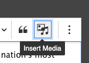
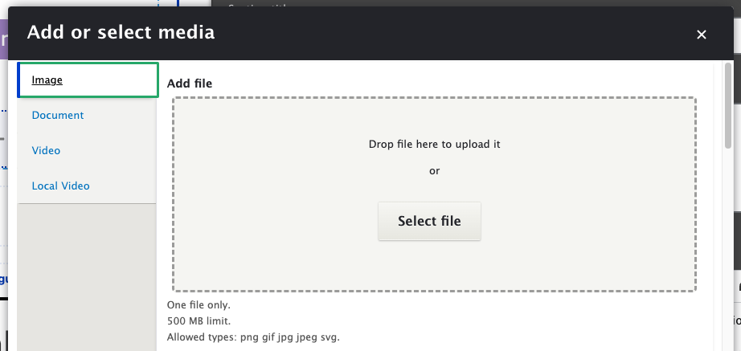
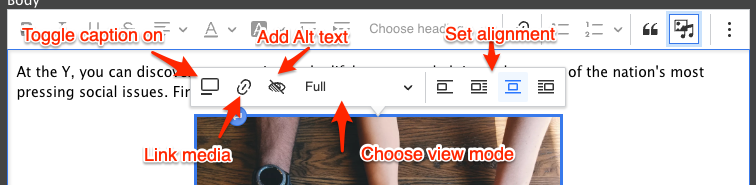

Once your site is updated to use CKEditor 5 you will see a new **Insert Media** button that unifies the processes for embedding Images, Documents, and Videos. 

## Add or select media

1. To get started, click **Insert Media** in the CKEditor toolbar (or try the <abbr title="Show more items"><kbd> ⋮ </kbd></abbr> button if it's hidden). You will be presented with the **Add or select media** dialog. 
2. Choose the media type (Image, Document, etc.) that you would like to embed from the list on the left. 
3. Add or upload your media:
    - If you are adding new media:
      - If given the option, drag and drop the item from your filesystem to the dialog, or click **Select File**.
      - For Video (via YouTube or Vimeo), add the video directly via **Admin** > **Content** > **Media** **Add Media** > **Video** before opening the dialog.
    - If you are reusing media that exists on the site, scroll down and search for the item, then click the checkbox to select it.
4. Choose **Insert selected** to embed the chosen media.

## Customizing your media

Once your media has been inserted into the field, you can hover over the media to choose from a variety of options.

### Toggle caption on

Displays a **Caption** area below your image. Once toggled, type your caption below the image.

### Link media

Allows the media to be linked. See [Adding Links](../adding-links) for more information.

### Override media image alternative text

_(for Images only)_

Allows you to add alternative text to the media. See [WebAIM's guidelines on Alternative Text](https://webaim.org/techniques/alttext/) for help choosing the right alt text for your image.

### View mode

Allows you to select the size of the image. Typically you might choose "Full", "Half", or "Thumbnail". Options may vary depending on site configuration.

### Alignment

Choose how to align the media:

- Break text
- Align left and wrap text
- Align center and break text
- Align right and wrap text

### Moving your media

Click and drag anywhere on the inserted media to relocate it in the WYSIWYG area.

Use the <kbd>⮐</kbd> button at the top or bottom of the media to insert a paragraph before or after it.

### Deleting your media

Click to select the media, then type <kbd>Delete</kbd> to remove it.
