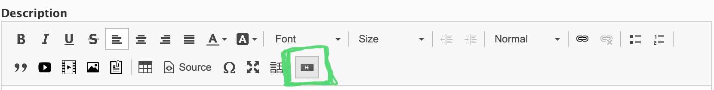

> **Note:** The Button editor for CKEditor 5 in Drupal 10 is not yet complete. We have documented [an alternative process](../adding-links#using-button-classes).



-----

[As an alternate to using the link tool](../adding-links), you can easily create buttons with YMCA Website Services using the button editor. When you click on the button icon, it will open a pop-up.

>You can also edit a button you've created previously by clicking on the link in the text editor.

There are three tabs for creating your button: an info tab, a target tab, and an icon tab.

---
## Info Tab

This screen gives you basic options to style your link or button. On the top left “Style Option,” you will have several options to style your button or output it as a link.

* The link option will allow you to embed your link text in line with a paragraph.
* In Lily, all button styles other than link default to purple.
* In Rose, all options except “default” will output a blue button. “Default” outputs a white button.
* In Carnation, the button options all output different colors.

### Button Guide Example:

> @mlefler From the YMCA of Lincoln, NE, [built this guide to provide examples](https://www.ymcalincoln.org/buttons) of possible styles for buttons. Ask your developer partner to provide you a style guide for your site.

The top right “Size” dropdown four options for your button size. If you chose “Link” style option, the Size option will not affect your link.

Add the text for your link/button in the bottom left. Enter your link in the URL field on the bottom right.

* For links on your website, don’t use the full URL. Highlight everything beginning with the `/` after your `.com`, `.org`, etc.
  * For example, for example.org/about, you would choose `/about`. This is called the relative path, and it will help your analytics tracking.
* For links on other websites, grab the full URL, including the `https://`.
  * For example, for example.org/about, you should choose `https://example.org/about`.
* For email links, add `mailto:example@exampleymca.org.`

[More on absolute vs relative links](https://www.coffeecup.com/help/articles/absolute-vs-relative-pathslinks/).

---

## Target Tab

This tab gives you the ability to change the behavior of your link. By default, all links will have a “not set” behavior, which means the link will open in the same active tab. The other options include…

* Frame
* Popup
* New Window
* Topmost Window
* Same Window
* Parent Window

**[» Learn about link targets](http://www.tagindex.net/html/frame/a_target.html)**

---

## Icons Tab

You can add icons to your buttons or links in the icons tab. On the right, you will have fields that integrate with the Font Awesome library. To have an icon show up on the left, use the Left Icon text field. For the right, use the Right Icon text field.

*Example:* For a Right Chevron, type `fa-chevron-right`.

**View free font awesome icons at [fontawesome.com](https://fontawesome.com/v5/search?m=free)**

>**Note:** The left field makes reference to the Bootstrap Glyphicons library. As of this documentation, this icon library has been deprecated, and the Glyphicons fields will not work in YMCA Website Services.
>
>Because the button embed is an open-source tool developed by a third party, these fields will go away once the code’s maintainer updates the code.
