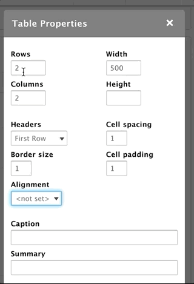
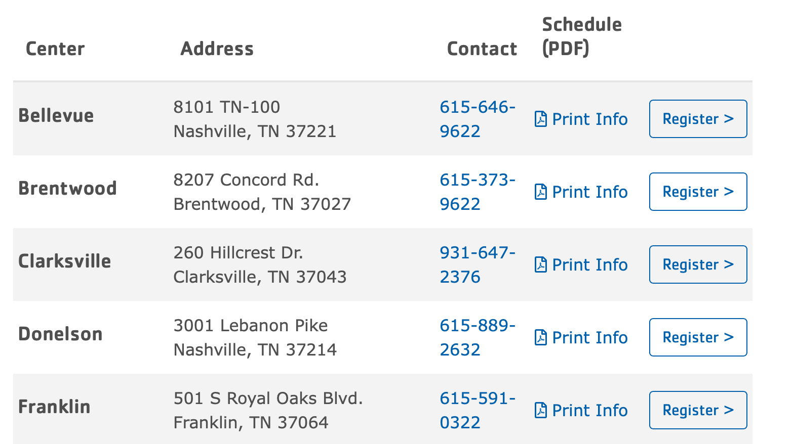

## Tables in CKEditor 5

The table editor has been drastically improved in CKEditor 5 and is described in detail [in their documentation](https://ckeditor.com/docs/ckeditor5/latest/features/tables/tables.html).

## Tables in CKEditor 4



---

### Adding a New Table
To add a table, click on the table icon. A popup will appear with your initial setup options:

    


* Set the number of rows and columns by typing numbers into those fields
* The headers field dropdown gives you options to create a header column, row, or both.
  * This will count toward the total number of rows/columns in your table, so if you select four rows and have a header row, you will have three rows beneath that header.
* Set the width and height in the top right text fields.
  * If you add no unit, the number you enter will default to pixels.
  * The fields also support percentages (such as 100%). We recommend percentages when you’re putting table in paragraphs other than simple content.
* Style your table with the border size, cell size, and cell padding fields
  * Like the Height and Width fields, units default to pixels.
* Align the values inside your cells using the Alignment dropdown.
* Add a caption to your table using the Caption field
  * Captions will display above the table in Lily and Rose.
  * Captions display below the table in Carnation.
* The summary field provides a brief description for your table for screen readers and accessibility devices. It does not print out visible text.

### Editing the Table

To edit a table after you’ve built one, right click on the table. To access the basic table options, click on “Table Properties.”


You can also double-click inside a table cell.

### Adding Rows/Columns

To add a row or column, right-click and go to either “Row” or “Column” in the options that appear. You can insert a row or column before or after the current row/column.

### Deleting Rows/Columns

Both the row and column options allow you to delete from the right-click options as well. Just right-click > Row or Column > Delete Row OR Delete Column.

To delete multiple rows or column, just highlight the rows or columns you want to delete.

### Formatting Individual Cells/Groups of Cells

The “Cell” option from the right-click menu gives you same options as Row and Column, including inserting cells and deleting cells. You can also merge cells or split cells as you would in an excel table by selecting those options from the right-click menu.

However, there is another option called “Cell Properties” that allows you to style your cells as well. Just right-click > Cell > Cell Properties.


This opens a dialogue box similar to the table properties. You can set the width/height for your cell (pixels only for height; pixels or percentages for your width) in the fields on the left.

Farther down on the left, you can choose from a dropdown whether or not to wrap the text in a cell.

You can also use dropdowns to set your vertical and horizontal alignments for your cells.

On the bottom right, you can set your border and background colors for your cells. These field support hexadecimal (#FFF) and rgba (256,256,256,1.0) color formats.

[Understanding hex colors](https://www.pluralsight.com/blog/tutorials/understanding-hexadecimal-colors-simple).

Finally, you can edit your cells to “span” two or more rows or columns. For example, if you have a header cell you want to span two columns, you can set the “Columns Span” field to 2.

If you would like to apply these styling options to multiple cells, just highlight the cells you want to edit and Right-Click > Cell > Cell Properties.

---

### Table Examples
To see an example of what a table might look like on your site, open the "Source" tab on your text editor and insert the HTML. You can then edit the content inside using the WYSIWYG text editor.

#### // Pricing Table


```html
    <h2>Registration and Pricing</h2>
    <table align="left" border="1" cellpadding="5" cellspacing="1" style="width: 500px;">
    	<caption>*A $25 deposit is due at the time of registration.</caption>
    	<thead>
    		<tr>
    			<th scope="col">Pricing Period</th>
    			<th scope="col">Dates</th>
    			<th scope="col">Member Pricing</th>
    			<th scope="col">Non-Member Pricing</th>
    		</tr>
    	</thead>
    	<tbody>
    		<tr>
    			<td>Early Registration</td>
    			<td>Feb. 1-29</td>
    			<td>$120/week</td>
    			<td>$135/week</td>
    		</tr>
    		<tr>
    			<td>Regular Registration</td>
    			<td>March 1-May 1</td>
    			<td>$130/week</td>
    			<td>$150/week</td>
    		</tr>
    		<tr>
    			<td>Late Registration</td>
    			<td>May 1-End of Summer</td>
    			<td>$150/week</td>
    			<td>$175/week</td>
    		</tr>
    	</tbody>
    </table>
```

#### // Camp Locations


```html
    <style>
      // To achieve the full effect of this table, insert this style tag above the table or insert it into the CSS Editor module.
      /* margin fix for h6 embedded inside table */
    td > h6 {
      margin-bottom: 0;
    }

    /* Fix for mobile table -> issue seems to be related to aggregate CSS file */
    .field-answer tr,
    .field-answer td,
    .paragraph--type--simple-content tr,
    .paragraph--type--simple-content td {
      display: block !important;
      border: none;
    }

    .field-answer td,
    .paragraph--type--simple-content td {
      padding: .75rem .31rem;
      text-align: left;
      vertical-align: middle;
    }

    .field-answer tr,
    .paragraph--type--simple-content tr {
      padding: .625rem 0;
    }

    .field-answer thead,
    .paragraph--type--simple-content thead {
      display: none;
    }

    @media (min-width: 992px) {
      	.field-answer tr,
    	.paragraph--type--simple-content tr {
          display: table-row !important;
      }
        .field-answer td,
      	.paragraph--type--simple-content td {
          display: table-cell !important;
      }
      .field-answer thead,
      .paragraph--type--simple-content thead {
        display: table-header-group;
      }
    }
           </style>
    <div class="table-responsive">
    <table align="left" cellpadding="10" cellspacing="10" class="w-100 table table-striped">
    	<thead>
    		<tr>
    			<th scope="col">
    			<h5>Center</h5>
    			</th>
    			<th scope="col">
    			<h5>Address</h5>
    			</th>
    			<th scope="col">
    			<h5>Contact</h5>
    			</th>
    			<th scope="col">
    			<h5>Schedule (PDF)</h5>
    			</th>
    			<th scope="col">&nbsp;</th>
    		</tr>
    	</thead>
    	<tbody>
    		<tr>
    			<td>
    			<h5>Bellevue</h5>
    			</td>
    			<td>8101 TN-100<br />
    			Nashville, TN 37221</td>
    			<td><a href="tel:615-646-9622">615-646-9622</a></td>
    			<td>
    			<p><a href="/sites/default/files/2020-01/dycmp-20-dycmp-pdf-bellevue-menu.pdf"><i class="far fa-file-pdf">&nbsp;</i>Print Info</a></p>
    			</td>
    			<td><strong><a class="btn btn-outline-primary" href="https://operations.daxko.com/Online/4002/ProgramsV2/Search.mvc?program_id=TMP8151&amp;location_ids=B58&amp;category_ids=TAG12062">Register&nbsp;&gt;</a></strong></td>
    		</tr>
    		<tr>
    			<td>
    			<h5>Brentwood</h5>
    			</td>
    			<td>8207 Concord Rd.<br />
    			Brentwood, TN 37027</td>
    			<td><a href="tel:615-373-9622">615-373-9622</a></td>
    			<td><a href="/sites/default/files/2020-01/dycmp-20-dycmp-pdf-brentwood-menu.pdf"><i class="far fa-file-pdf">&nbsp;</i>Print Info</a></td>
    			<td><strong><a class="btn btn-outline-primary" href="https://operations.daxko.com/Online/4002/ProgramsV2/Search.mvc?program_id=TMP8151&amp;location_ids=B45&amp;category_ids=TAG12062">Register&nbsp;&gt;</a></strong></td>
    		</tr>
    		<tr>
    			<td>
    			<h5>Clarksville</h5>
    			</td>
    			<td>260 Hillcrest Dr.<br />
    			Clarksville, TN 37043</td>
    			<td><a href="tel:931-647-2376">931-647-2376</a></td>
    			<td><a href="/sites/default/files/2020-01/dycmp-20-dycmp-pdf-clarksville-menu.pdf"><i class="far fa-file-pdf">&nbsp;</i>Print Info</a></td>
    			<td><strong><a class="btn btn-outline-primary" href="https://operations.daxko.com/Online/4002/ProgramsV2/Search.mvc?program_id=TMP8151&amp;location_ids=B54&amp;category_ids=TAG12062">Register&nbsp;&gt;</a></strong></td>
    		</tr>
    		<tr>
    			<td>
    			<h5>Donelson</h5>
    			</td>
    			<td>3001 Lebanon Pike<br />
    			Nashville, TN 37214</td>
    			<td><a href="tel:615-889-2632">615-889-2632</a></td>
    			<td><a href="/sites/default/files/2020-01/dycmp-20-dycmp-pdf-donelson-menu.pdf"><i class="far fa-file-pdf">&nbsp;</i>Print Info</a></td>
    			<td><strong><a class="btn btn-outline-primary" href="https://operations.daxko.com/Online/4002/ProgramsV2/Search.mvc?program_id=TMP8151&amp;location_ids=B41&amp;category_ids=TAG12062">Register&nbsp;&gt;</a></strong></td>
    		</tr>
    		<tr>
    			<td>
    			<h5><a>Franklin</a></h5>
    			</td>
    			<td>501 S Royal Oaks Blvd.<br />
    			Franklin, TN 37064</td>
    			<td><a href="tel:615-591-0322">615-591-0322</a></td>
    			<td><a href="/sites/default/files/2020-01/dycmp-20-dycmp-pdf-franklin-menu.pdf"><i class="far fa-file-pdf">&nbsp;</i>Print Info</a></td>
    			<td><strong><a class="btn btn-outline-primary" href="https://operations.daxko.com/Online/4002/ProgramsV2/Search.mvc?program_id=TMP8151&amp;location_ids=B53&amp;category_ids=TAG12062">Register&nbsp;&gt;</a></strong></td>
    		</tr>
    </tbody>
    </table>
```
