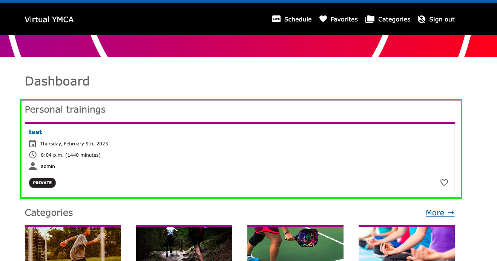

This module is distributed as part of the YCMA Virtual Experience Platform (Virtual Y). Review [the README](https://github.com/YCloudYUSA/yusaopeny_gated_content/tree/master/modules/openy_gc_personal_training) for more technical information.

## Initial configuration

1. Go to **Admin** > **Extend** (`/admin/modules`) and enable the **Virtual Y 1on1 Meeting** (`openy_gc_personal_training`) module.
2. Go to **Admin** > **Virtual Y** > **1on1 Meeting** > **Settings** (`/admin/virtual-y/personal_training/settings`) and put `signals.cibox.tools:8091` as the Signaling PRL.
3. Go to **Admin** > **People** (`/admin/people`) and add the **Virtual YMCA Editor** role to the user profile of any users who will create meetings. 
    - **NOTE:** The `admin` user will also need to have this role set.
4. Also at **Admin** > **People** (`/admin/people`), add the `Virtual trainer` role to at least one user.
5. If you are starting a new site, log in as a Virtual Y member at least once.
6. Go to **Admin** > **Virtual Y** > **1on1 Meeting** (`/admin/virtual-y/personal_training`) and you should be able to see a dashboard with links to add a 1on1 meeting.
    - If you receive an `Access denied` error, be sure to check that you have the **Virtual YMCA Editor** role as noted in 3.

{}
The community-maintained server, `signals.cibox.tools`, will work for most sites at small to medium levels of 1-on-1 traffic. If you are planning to scale up this service you may need to maintain a separate [signaling server](https://github.com/open-y-subprojects/virtual_y_signaling_server/blob/main/README.md)
{}

## Creating a 1on1 meeting

1. Go to **Admin** > **Virtual Y** > **1on1 Meeting** (`/admin/virtual-y/personal_training`)
2. Add a single 1on1 meeting or a series and fill in the form.

## Joining a 1on1 meeting

1. Once a 1on1 meeting is created, the customer and trainer will see a card for the call in the Virtual Y dashboard.

2. Both the Trainer and Customer should open this card, join the meeting, provide their names, and proceed with the call.
