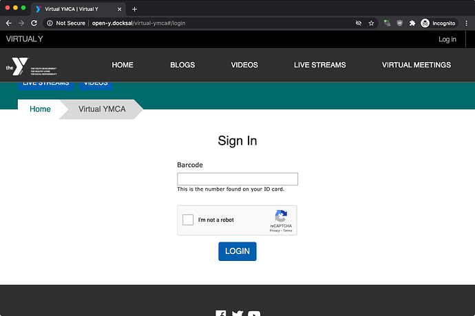
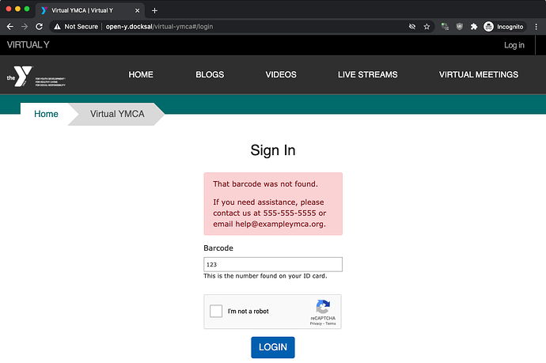

Open Y Gated Content (Virtual Y) [release 0.13](https://github.com/ymcatwincities/openy_gated_content/releases/tag/0.13) includes a new authentication provider to support Daxko Virtual Areas. This will allow associations using Daxko to set up Virtual Area that enable members to access Virtual Y content using only their member barcode!

Instructions for setting up Virtual Areas are in [<i class="fa fa-file-pdf"></i> Daxko's documentation](./Daxko%20Operations%20-%20Virtual%20Check%20In%20-%20Barcode.pdf). If you need assistance configuring Virtual Areas, Daxko's support team can assist you in setup: [support@daxko.com](mailto:support@daxko.com) 

## Configuration

1. Enable `Daxko Barcode Virtual YMCA integration`
1. OPTIONAL (but highly recommended): configure reCaptcha settings at `/admin/config/people/captcha/recaptcha`.
1. Add your validation secret and form url and check help messages at `/admin/openy/virtual-ymca/gc-auth-settings/provider/daxkobarcode`.
1. Save your settings.
1. Set Daxko Barcode as your main authorization plugin at the Virtual YMCA settings: `/admin/openy/openy-gc-auth/settings`.

Once enabled, the module enables granular configuration to messages that users will receive on the page. It allows changing "Barcode" to something different, like "Member ID", and allows adding help text to assist members in finding their ID. It also allows for global help text to direct members to help channels in case they're unable to log in.

Once the module is enabled, members will be presented with the appropriately titled field to log in to Virtual Y.

Upon success the user will be logged in to Virtual Y. Upon failure the failure state will be returned along with a help message provided by the association.

## Notes

### Members with a Balance Due

> Anyone with a balance due in Daxko doesn't have access to Virtual Y [via Daxko Barcode]. A lot of the accounts with balances are families with memberships who receive state scholarships for child care. The balance in Daxko is the portion the state pays, so it's a bit of a "fake" balance. Any way for us to allow any ACTIVE member to use [Virtual Y], regardless if they have a balance or not?

The fix:

> There’s a setting on the Daxko Operations virtual area at **Membership** > **Virtual Area** > **Virtual Y** > **Edit** that you can check/uncheck for “Block access when balance due.” You can uncheck that and it should let the member access the virtual area.