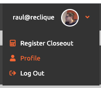
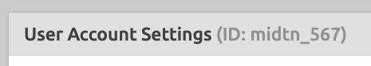
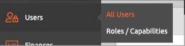
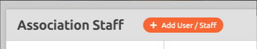
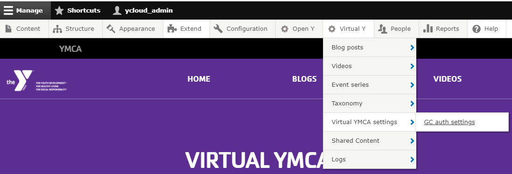
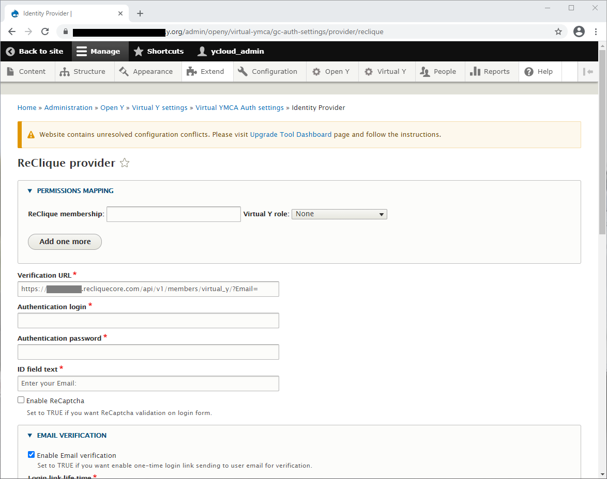

The ReClique Core API enables check-in access by specifying member Email address. Following are the steps necessary to fully configure the ReClique Provider.

## Acquire ReClique Core API Access

To get started, you will need to do the following activities in the ReClique CORE portal, while logged in as a YMCA super admin user:

- Locate and note your YMCA association’s YMCA ID, known within the ReClique CORE documentation as the “Association Slug”.
- Create a separate user for executing the ReClique CORE authentication API, and grant this user API level access

**In detail:** 

1. Log into the ReClique Core portal using a user with YMCA super administrator role.
2. Click “Profile” in the top-right corner of the CORE portal. 
3. The YMCA ID is the non-numeric part of the “Association Slug” in front of the numeric user id. Please note this value for use in the Verification URL. In this example, the text `midtn` is this association slug value, and is what is needed for the YMCA ID. 
4. Click “Users” from the navigation menu (Users > Add New User) 
5. Select the “+ Add User / Staff” button. 
6. Create a stand-alone user for the purpose of executing API calls only. A suggested name is `virtual_y`, but any suitable name can be used.
7. Assign this user the API Access role by selecting “Use Core API” in the Other list of role options. 

## Configure the Virtual Y ReClique Provider

For the Virtual Y site to communicate with the ReClique Core API, you’ll need to configure the ReClique provider. Configuring the ReClique provider is quick and easy.

1. Navigate to the Gated Content Auth Setting Page at **Manage** > **Virtual Y** > **Virtual YMCA Settings** > **GC Auth Settings** 
    - The GC Auth Settings page, when loaded, will look like the following: 
2. Find the ReClique Provider option and click the Edit Action 
3. Enter Your ReClique Provider Settings. 
    - The ReClique Provider configuration page allows specification of permission mappings, the settings for accessing the ReClique CORE authentication API, and Email Verification settings. 
    1. Specify Permission Mappings
        - This is used for User Segmentation. User Segmentation will allow YMCAs to segment content to particular Virtual Y roles based on membership types. Refer to documentation from the Open Y Community for more information about [Setting up user segmentation](../../user-segmentation/). 
    2. Add ReClique CORE API settings
        - Here, you’ll add the values needed to connect to the ReClique Core API. 
            | Field | Value |
            |-----|------|
            | Verification URL | The API endpoint provided by ReClique to verify member logins. It takes the form `https://{Y_ID}.recliquecore.com/ api/v1/members/virtual_y/?Email=` (This is the Production verification URL) |
            | Authentication login | The login for the dedicated user created with ‘Use Core API’ access in the ReClique Core portal. |
            | Authentication password | The password for the dedicated user created with ‘Use Core API’ access in the ReClique Core portal. |
            | ID field text | The text to be displayed on the Virtual Y login form. Default value is “Enter your Email:” |
    3. Specify the Email Verification options
        - This will enable a one-time login link to be sent to the member’s email for verification. Here, you can configure the length of time the login link will last before needing to generate another, email verification text, and message displayed to the member with instructions on how to proceed with logging into the Virtual Y site. 
    4. Specify the Verification Message
        - This is the message the member will see when logging in if they are Inactive. The phone number must be added at the very least. 
    5. After configuring the ReClique provider, click “Save”.
    6. From the GC Auth Settings page, make sure only “ReClique Provider” is selected and click, “Save”.
     
Your ReClique Provider is now fully configured and is ready for use.

To test, logout from the admin portal. You should now see, from the Home Page, your new login form configured ready to accept input.

If a valid Email Address is entered and the member is Active, the member will be allowed access to your gated content (videos, blog post, virtual meetings).
