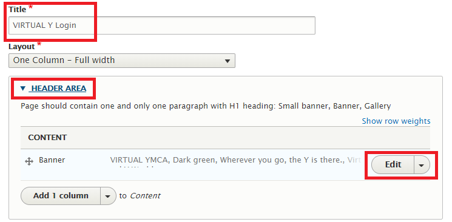

Please follow these steps if you wish to customize the photo users will see when they log into the Virtual Y site.

For updating the image *before* the user logs in...

1. Log into site as Site Owner
2. Manage > Content (click directly on Content, not one of its sub-menus)
3. In the grid, find "Virtual YMCA Login" and click the Edit button for that row.
4. Expand the "Header Area"
5. Click the "Edit" button next in the Banner row.
 
6. Expand the "Image" section, and where the current image is and click the Remove button underneath the image (not Edit).
 
7. Re-expand the "Image" section, and click the "Select Images" button.
8. If the desired image is not already in the system, click the Upload images link to add that picture.
9. If the image is already in the system, select that image and click "Select media".
 
10. Scroll down to the bottom of the page and click Save.

If you wish to also modify the image the user sees *after* they log in, repeat the above steps, but substitute in step #3 "Virtual YMCA" in place of "Virtual YMCA Login".