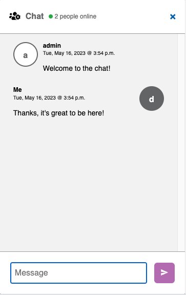
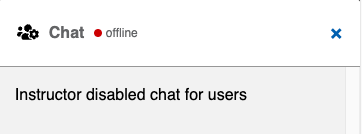
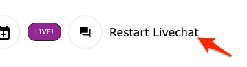

This module is distributed as part of the YCMA Virtual Experience Platform (Virtual Y). Review [the openy_gc_livechat README](https://github.com/YCloudYUSA/yusaopeny_gated_content/tree/master/modules/openy_gc_livechat) for more technical information.

## Initial configuration

1. Go to **Admin** > **Extend** (`/admin/modules`) and enable the **Virtual Y Livechat** (`openy_gc_livechat`) module.
2. Go to **Admin** > **Virtual Y** > **Virtual YMCA Settings** > **Livechat Settings** (`/admin/openy/virtual-ymca/gc-livechat-settings`). Review the settings, and modify if necessary.
3. Go to **Admin** > **People** > **Roles** > **Add role** (`/admin/people/roles/add`) and add a role entitled **Virtual Trainer** if it does not exist.
    - Assign this role to any user who should have the ability to disable chat.
    - **NOTE:** The `admin` user will also need to have this role set.

## Joining a Live Chat

1. Visit any Live Stream event. **At the time that the event starts**, a Live Chat button will appear below the video. 
    - The button **will not** be visible before the event start time. To allow attendees to join before the meeting, set the start time to a few minutes before your actual start.
2. All participants can enter the chat, set their name, and chat throughout the entire Live Stream event. 

## Moderating a Live Chat

- At any point during a chat session, users with the **Virtual Trainer** role have the ability to disable the chat using the **Disable Chat** button. 
- Users will see a message saying "Instructor disabled chat for users" 
- Chat can be restarted using the **Restart Livechat** button on the event page, next to the chat icon. 
- Disabling chat will remove the history of that chat from the server.

## Chat History

- Each Livestream saves its history for a certain amount of time.
    - The default is 30 days and can be configured in the **Live Chat Settings** (`/admin/openy/virtual-ymca/gc-livechat-settings`).
- Chat history is saved and can be viewed at **Admin** > **Virtual Y** > **Virtual Meeting Chat Logs** (`/admin/virtual-y/chats`).

## Troubleshooting

- If the chat button is not appearing or the dialog displays "Chat is not available" or "Chat is not working at the moment" you will need to check with your development partner to ensure the [Livechat service](https://github.com/YCloudYUSA/yusaopeny_gated_content/tree/master/modules/openy_gc_livechat#livechat-feature-for-virtual-y) is properly configured on your server. 
