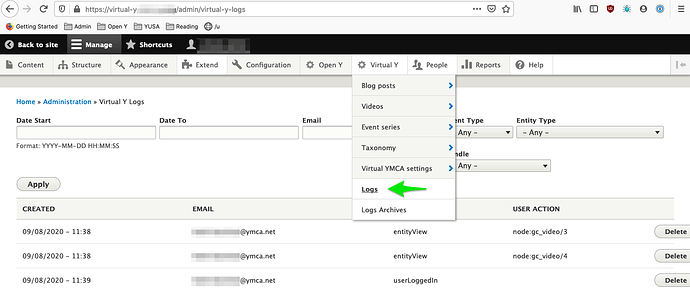

Introduced in [Virtual Y 0.7](https://github.com/ymcatwincities/openy_gated_content/releases/tag/0.7), the "Open Y Virtual YMCA Log" module generates logs to record user behavior on Virtual Y sites.

To enable the module, visit the **Extend** page on your site, or ask your partner for assistance.

Once the Log module is enabled, you'll see two new items in the **Virtual Y** menu:

## Logs

 
 
The **Virtual Y Logs** page displays searchable and filterable individual user activity. Additionally individual log items can be removed.

Activities that are currently being tracked include:
- User log in
- User views content

The Open Y team is working to add additional logging functionality as they gather requirements. If you have additional logging requirements for your reporting, please [contact the YMCA Website Services team](mailto:ycloud@ymca.net) with as much detail about your requirements as possible.

## Logs Archives

As of [Virtual Y 1.1](https://github.com/ymcatwincities/openy_gated_content/releases/tag/1.1), log archives can be generated on-demand via **Virtual Y** > **Logs** > **Export Log Records**

While logging begins immediately, (prior to VY 1.1) log archives should appear on the first day of the month following when logging is enabled. Log archives will be available as `.gz` files. The archive stores data indefinitely, but the log itself then deletes out the previous month's info out of the database to start collecting data for the current month.

- **Virtual Y** > **Logs** stores ONLY the current month's records
- **Virtual Y** > **Logs** > **Logs Archives** keeps monthly archives indefinitely, in the format `virtual-y-logs-2021-01.csv.gz`

The log archive process depends on Drupal's `cron` task, so you'll need to ensure that `cron` is running periodically on your site.

To extract files on Mac:
- The system's Archive Utility should work to extract files. If that fails...
- (Easy) Download [Keka](https://www.keka.io/en/) or [The Unarchiver](https://apps.apple.com/us/app/the-unarchiver/id425424353?mt=12), install, and use it to extract the file.
- (Advanced) Open a Terminal window and navigate to the directory where the zip is, then run `gunzip my_log_file.csv.gz`

To extract files on Windows:
- Use [7Zip](https://www.7-zip.org/) to extract the `.gz` file.
- Open with Excel or Google Sheets.

To extract files without a separate download:
- Use http://online.b1.org/online

### Translating timestamps
Your Virtual Y log archives may include times in the `created` column that look like `1606839555`. This is a format called "Unix epoch time". You can convert it to a human-readable format in a few ways:
- Visit https://www.epochconverter.com/ and paste in a value
- In Excel/Google Sheets:
  - Use the formula `=(A1/86400)+DATE(1970,1,1)`, substituting the correct cell for `A1`
  - Right-click on the column, select "Format Cells", then choose a Date format.