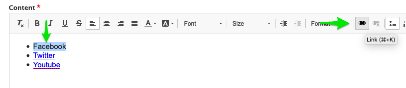
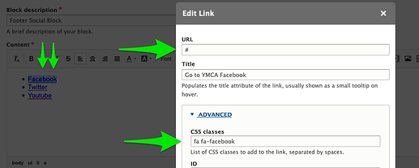

Your standalone Virtual Y site may have a block with social media links at the bottom of the page. These links can be customized for many social media services.

## Getting to the block editor

Your site may have a "Quick Edit" icon (a tiny pencil) that pops up when you hover over the section with the links. If so, click the pencil, then **Edit**.

 

OR

If you don't see the Quick Edit option, you can navigate to the block editor at **Structure** > **Block Layout** > **Custom Block Library** > **Edit Footer Social Block**

 

## Editing the block

On in the Block editor you will see a **Content** field with links to your social media sites. 

### Adding a link

- Add a new item to the bulleted list.
- Select the text.
- Click the link icon.

 

### Editing links

- Select text to link or double-click on an existing link
- In **URL** add the link to the social media site
- Edit the **Title** to something more descriptive
- Open the **Advanced** section and update the **CSS classes** to select the correct icon. Be sure to copy the entire `code` below 
  - Facebook: `fa fa-facebook`
  - Twitter: `fa fa-twitter`
  - YouTube: `fa fa-youtube`
  - Instragram: `fa fa-instagram`
  - Vimeo: `fa fa-vimeo`
  - [Many other options](https://fortawesome.com/sets/font-awesome-5-brands).

When you are finished, **Save**.