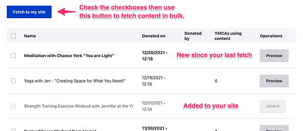

[Requirements](#requirements) | [Getting Started](#getting-started) | [Fetching Shared Content](#fetching) | [Publishing Shared Content](#publishing) | [FAQ](#faq)

[Released in 0.12](https://github.com/ymcatwincities/openy_gated_content/releases/tag/1.2), Virtual Y's Shared Content module allows Y's to share their content with other associations/branches and to pull shared content to use on their own site.

## Requirements

### Open Y Gated Content Module

- While Shared Content is supported in Open Y Gated Content >=0.12, we recommend that you use [version 1.0 or greater](https://github.com/ymcatwincities/openy_gated_content/releases) for the best support.

### Hosted Videos

- Any **YouTube** video that works in Virtual Y will be sharable.
- **Vimeo** videos that use the "Only on sites I choose" privacy setting **should not be shared**. Please review the [Vimeo Privacy Settings Overview](https://vimeo.zendesk.com/hc/en-us/articles/224817847-Privacy-settings-overview) for full details. If you plan to share content on Vimeo, we recommend:
  - **Who can watch?** - "People with the private link" OR "Hide this video on vimeo.com"
  - **Where can this be embedded?** - "Anywhere"

## Getting Started

To start sharing content, you need to get your site ready.

### Enable the modules

On the Drupal **Extend** page (`/admin/modules`), enable **Virtual Y Shared Content**. If your site is hosted on a managed hosting environment, this step is either already done for you or will need to be done by your hosting partner.

Accept any other required modules if asked.

### Connect your site to the Open Y server

In order to share content, you'll first need to register your site with the Open Y shared content server:

- Go to **Virtual Y** > **Shared Content** > **Source Servers** (`/admin/virtual-y/shared-content/server`)
- Use the **List additional actions** arrow (`▾`) under Operations then **Edit**

 

On the following page, simply **Save** the form. Once you've saved the form and your site is able to contact the server, the **Source Token** will be populated.

 

New connection requests are curlreviewed periodically and are approved by the Open Y team to prevent abuse. Please allow up to two business days for approval, or email [ycloud@ymca.net](mailto:ycloud@ymca.net) with the URL of your site to request approval.

## Fetching Shared Content

Once you are connected to the server you may, at any point, **Fetch** content from the server:

- Go to **Virtual Y** > **Shared Content** > **Source Servers** (`/admin/virtual-y/shared-content/server`)
- **Fetch** content from the **Open Y** server.

Your site will fetch **Virtual Y blog posts** and **Virtual Y Videos** from the server. In each list you may:

- **Preview** content using the button on the right.
- Check the box to the left of any content you'd like to use on your site.
- **Fetch to my site** to download the new content.

As of Virtual Y 1.6.1 (released in December 2021) the fetched content list will show items in different states:

- **Bold** items are new to the server since your last visit.
- Greyed out items have already been added to your site.

Also in VY 1.6.1, content can be fetched directly from the preview.

## Publishing Shared Content

You can share your own content to other Y's in the Movement too!

- Create your **Video** or **Blog post** as usual.
- To share a single item:
  - expand the **Shared Content** options on the sidebar of the content edit page,
  - then check "Available to share".

- To share multiple items, visit the **Content** list (`/admin/content`) then:
  1. Check the **Update this item** checkbox.
  2. In the **Action** dropdown, select **Share to Virtual Y**.
  3. Use the **Apply to selected items** button.

## FAQ

### Why can't another Y see my shared content?

New connection requests are reviewed periodically and are approved by the Open Y team to prevent abuse. Please allow up to two business days for approval, or email [ycloud@ymca.net](mailto:ycloud@ymca.net) with the URL of your site to request approval.

### Can I share content before my site is live?

If your site is in a "pre-live" mode and is somehow restricted from being publicly accessible (sometimes called "Site Lock" or "HTTP Auth") you will not be able to share content. Please wait until your site is live to share content.