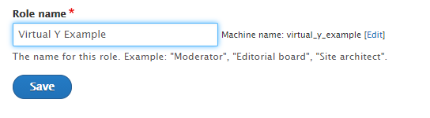

User segmentation is a feature within Virtual Y that can help you separate your users into different categories. This can allow you to diversify your 2021 membership strategy or break out your Virtual Y content into different categories (fitness, wellness, family enrichment, etc.).

## Set Up User Segmentation

1. On your Drupal toolbar, hover over Virtual Y, and click Virtual YMCA Settings. 
2. Click over to the tab labeled AUTH settings. You will see a list of authentication method options. If you do not see the desired authentication method, you will have to install it from the Extend menu.
 
3. Click Edit on the desired authentication method you will be using. User segmentation will be set up in the field labeled Permissions Mapping at the top of this page.
4. Within the membership field, carefully type in or paste the name of a membership type in your CRM that should be allowed to access Virtual Y. Then, in the dropdown, select what level of access should be granted to users with that membership type.  
5. Continue adding all accepted membership types by clicking the Add one more button until all accepted membership types are listed.
6. **If you want to remove a membership type:** Delete the membership name from the field and select None as the Virtual Y role. Then, scroll to the bottom of the page and click the blue Save button. The empty line should disappear from your mapping list. 

## Add a New Role

You may desire to add additional roles beyond the default 3 that are included in Virtual Y. We recommend including no more than 5 roles, as the level of fragmentation and content management upkeep becomes difficult to sustain beyond that number.

If you are not familiar with Drupal roles, it is recommended you reach out to your agency partner to help you customize your Virtual Y roles.

1. Click People in the Drupal toolbar
2. Select the Roles tab at the top of the page
 
3. Click the Add Role blue button
4. Enter in your new role name in the field. 
 

**Note:** the Machine Name for your role must begin with virtual_y_ or else it will not be included in the permissions mapping table. You can achieve this by either naming your official role "Virtual Y [Desired Role Name]" or by clicking the small Edit button link next to the Machine Name and editing the text.
